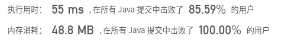

## [剑指 Offer 09. 用两个栈实现队列](https://leetcode-cn.com/problems/yong-liang-ge-zhan-shi-xian-dui-lie-lcof/)

## 题目

用两个栈实现一个队列。队列的声明如下，请实现它的两个函数 appendTail 和 deleteHead ，分别完成在队列尾部插入整数和在队列头部删除整数的功能。(若队列中没有元素，deleteHead 操作返回 -1 )

 

```java
示例 1：

输入：
["CQueue","appendTail","deleteHead","deleteHead"]
[[],[3],[],[]]
输出：[null,null,3,-1]
```

```java
示例 2：

输入：
["CQueue","deleteHead","appendTail","appendTail","deleteHead","deleteHead"]
[[],[],[5],[2],[],[]]
输出：[null,-1,null,null,5,2]
```

```java
提示：

1 <= values <= 10000
最多会对 appendTail、deleteHead 进行 10000 次调用
```

链接：https://leetcode-cn.com/problems/yong-liang-ge-zhan-shi-xian-dui-lie-lcof


## 解题记录

+ 一个栈中存放append的数据
+ 另一个栈中存放将要pop出颠倒顺序后的数据

```java
import java.util.Deque;
import java.util.LinkedList;

/**
 * @author ffzs
 * @describe
 * @date 2020/6/30
 */
public class CQueue {
    Deque<Integer> s1;
    Deque<Integer> s2;

    public CQueue() {
        s1 = new LinkedList<>();
        s2 = new LinkedList<>();
    }

    public void appendTail(int value) {
        s1.push(value);
    }

    public int deleteHead() {
        if (!s2.isEmpty()) return s2.pop();
        while (!s1.isEmpty()) s2.push(s1.pop());
        if (!s2.isEmpty()) return s2.pop();
        else return -1;
    }
}

```

