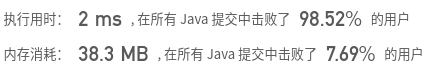

# README

### [67. 二进制求和](https://leetcode-cn.com/problems/add-binary/)


## 题目

给你两个二进制字符串，返回它们的和（用二进制表示）。

输入为 非空 字符串且只包含数字 1 和 0。

 

```java
示例 1:

输入: a = "11", b = "1"
输出: "100"
```

```java
示例 2:

输入: a = "1010", b = "1011"
输出: "10101"
```

```java
提示：

每个字符串仅由字符 '0' 或 '1' 组成。
1 <= a.length, b.length <= 10^4
字符串如果不是 "0" ，就都不含前导零。
```


## 解题思路

+ 将两个数根据最长的那个数的长度转化为char[]
+ 从后向前遍历，通过识别两个数该位数以及进位变量中1的个数来确定改值以及下一个进位值
+ 通过最后一个进位符加上char list 为返回值


```java
/**
 * @author ffzs
 * @describe
 * @date 2020/6/23
 */
public class Solution {
    public static String addBinary(String a, String b) {
        char[] aChar, bChar;
        int len = Math.max(a.length(), b.length());
        if (a.length() > b.length()) {
            aChar = a.toCharArray();
            bChar = charList(b, a.length() - b.length(), len);
        }
        else if (a.length() == b.length()) {
            aChar = a.toCharArray();
            bChar = b.toCharArray();
        }
        else{
            bChar = b.toCharArray();
            aChar = charList(a, b.length() - a.length(), len);
        }

        char[] res = new char[len];
        int next = 0;
        for (int i = len-1; i >= 0; --i) {
            int sum = aChar[i] + bChar[i] + next - 2 * '0';
            res[i] = (char)(sum % 2 + '0');
            next = sum / 2;
        }
        StringBuilder sb = new StringBuilder();
        if (next == 1) sb.append('1');
        sb.append(res);
        return sb.toString();
    }

    private static char[] charList (String s, int start, int len) {
        char[] seq = new char[len];
        for (int i = 0; i < len; i++) {
            if (i < start) seq[i] = '0';
            else seq[i] = s.charAt(i-start);
        }
        return seq;
    }

    public static void main(String[] args) {
        String a = "1010", b = "1011";
        System.out.println(addBinary(a, b));
    }
}

```

