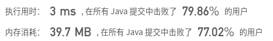

## [415. 字符串相加](https://leetcode-cn.com/problems/add-strings/)

## 题目

给定两个字符串形式的非负整数 num1 和num2 ，计算它们的和。

```java
注意：

num1 和num2 的长度都小于 5100.
num1 和num2 都只包含数字 0-9.
num1 和num2 都不包含任何前导零。
你不能使用任何內建 BigInteger 库， 也不能直接将输入的字符串转换为整数形式。
```


链接：https://leetcode-cn.com/problems/add-strings

## 解题记录

+ 通过比对num1和num2的长度，更换num确保num1是比较长的那个
+ 通过循环，两个字符串末位相加，确定进位情况
+ 之后再构成字符串，如果有进位的情况，前面加上字符1


```java
/**
 * @author: ffzs
 * @Date: 2020/8/3 上午8:20
 */
public class Solution {

    public static String addStrings(String num1, String num2) {
        if (num2.length() > num1.length()) {
            String tmp = num1;
            num1 = num2;
            num2 = tmp;
        }
        int len1 = num1.length();
        int len2 = num2.length();
        char[] addChar = new char[len1];

        int carry = 0;

        for (int i = 0; i < len1; i++) {
            int n1 = num1.charAt(len1-1-i)-'0';
            int n2 = i < len2?num2.charAt(len2-1-i)-'0':0;
            int sum = n1 + n2 + carry;
            carry = sum / 10;
            addChar[i] = (char)(sum % 10 + '0');
        }

        StringBuilder sb = new StringBuilder();
        if (carry == 1) sb.append('1');
        for (int i = addChar.length - 1; i >= 0; i--) {
            sb.append(addChar[i]);
        }
        return sb.toString();
    }

    public static void main(String[] args) {
        String num1 = "123456789";
        String num2 = "1111";
        System.out.println(addStrings(num1, num2));
    }
}
```

