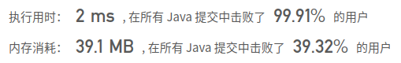

## [2. 两数相加](https://leetcode-cn.com/problems/add-two-numbers/)

## 题目

给出两个 非空 的链表用来表示两个非负的整数。其中，它们各自的位数是按照 逆序 的方式存储的，并且它们的每个节点只能存储 一位 数字。

如果，我们将这两个数相加起来，则会返回一个新的链表来表示它们的和。

您可以假设除了数字 0 之外，这两个数都不会以 0 开头。

```java
示例：

输入：(2 -> 4 -> 3) + (5 -> 6 -> 4)
输出：7 -> 0 -> 8
原因：342 + 465 = 807
```


链接：https://leetcode-cn.com/problems/add-two-numbers

## 解题记录

+ 因为是链表是逆向的，所以比较好处理
+ 通过每次计算一位，将余数写到新的链表中，然后记录商，进行下一位运算

```java
/**
 * @author: ffzs
 * @Date: 2020/10/4 上午8:37
 */


class ListNode {
    int val;
    ListNode next;
    ListNode() {}
    ListNode(int val) { this.val = val; }
    ListNode(int val, ListNode next) { this.val = val; this.next = next; }
}

public class Solution {
    
    public ListNode addTwoNumbers(ListNode l1, ListNode l2) {
        ListNode res = new ListNode(-1);
        ListNode cur = res;
        int carry = 0;
        while (l1 != null || l2 != null || carry != 0) {
            int sum = (l1==null?0:l1.val) + (l2==null?0:l2.val) +carry;
            if (cur.val==-1) {
                cur.val = sum%10;
            }else{
                cur.next = new ListNode(sum%10);
                cur = cur.next;
            }
            carry = sum / 10;
            l1 = l1==null?null:l1.next;
            l2 = l2==null?null:l2.next;
        }
        return res;
    }
}
```

