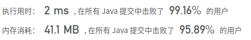

## [637. 二叉树的层平均值](https://leetcode-cn.com/problems/average-of-levels-in-binary-tree/)

## 题目

给定一个非空二叉树, 返回一个由每层节点平均值组成的数组。

```java
示例 1：

输入：
    3
   / \
  9  20
    /  \
   15   7
输出：[3, 14.5, 11]
解释：
第 0 层的平均值是 3 ,  第1层是 14.5 , 第2层是 11 。因此返回 [3, 14.5, 11] 。
```

```java
提示：

节点值的范围在32位有符号整数范围内。
```


链接：https://leetcode-cn.com/problems/average-of-levels-in-binary-tree

## 解题记录

+ 简单的层序遍历，通过queue存储每一层
+ 通过size循环取数，同时统计求和
+ 循环完成后取平均值放入结果列表中

```java
/**
 * @author: ffzs
 * @Date: 2020/9/12 上午7:04
 */

class TreeNode {
    int val;
    TreeNode left;
    TreeNode right;
    TreeNode(int x) { val = x; }
}

public class Solution {

    public List<Double> averageOfLevels(TreeNode root) {

        List<Double> res = new ArrayList<>();

        Deque<TreeNode> queue = new LinkedList<>();

        queue.offer(root);
        while (!queue.isEmpty()) {
            int size = queue.size();
            double sum = 0;
            for (int i = 0; i < size; i++) {
                TreeNode current = queue.poll();
                sum += current.val;
                if (current.left != null) queue.offer(current.left);
                if (current.right != null) queue.offer(current.right);
            }
            res.add(sum /size);
        }
        return res;
    }
}
```

