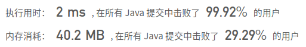

## [39. 组合总和](https://leetcode-cn.com/problems/combination-sum/)

## 题目

给定一个无重复元素的数组 candidates 和一个目标数 target ，找出 candidates 中所有可以使数字和为 target 的组合。

candidates 中的数字可以无限制重复被选取。

说明：

所有数字（包括 target）都是正整数。
解集不能包含重复的组合。 

```java
示例 1：

输入：candidates = [2,3,6,7], target = 7,
所求解集为：
[
  [7],
  [2,2,3]
]
```


```java
示例 2：

输入：candidates = [2,3,5], target = 8,
所求解集为：
[
  [2,2,2,2],
  [2,3,3],
  [3,5]
]
```


```java
提示：

1 <= candidates.length <= 30
1 <= candidates[i] <= 200
candidate 中的每个元素都是独一无二的。
1 <= target <= 500
```


链接：https://leetcode-cn.com/problems/combination-sum

## 解题记录

+ 通过回溯算法求解
+ 注意没一轮的起始不要小于之前的数值
+ 且大于target的值得化直接跳过

```java
/**
 * @author: ffzs
 * @Date: 2020/9/9 上午7:02
 */

public class Solution {
    List<List<Integer>> res = new ArrayList<>();
    int [] candidates;
    int n;
    public List<List<Integer>> combinationSum(int[] candidates, int target) {
        this.candidates = candidates;
        this.n = candidates.length;
        dfs(target, 0, new ArrayList<>());
        return new ArrayList<>(res);
    }

    private void dfs (int target, int start, List<Integer> list) {

        if (target == 0) {
            res.add(new ArrayList<>(list));
        }
        else if (target > 0) {
            for (int i = start; i < n; i++) {
                if (target >= candidates[i]) {
                    list.add(candidates[i]);
                    dfs(target-candidates[i], i, list);
                    list.remove(list.size()-1);
                }
            }
        }
    }
}
```

