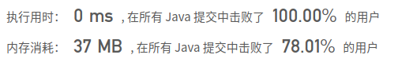

## [216. 组合总和 III](https://leetcode-cn.com/problems/combination-sum-iii/)

## 题目

找出所有相加之和为 n 的 k 个数的组合。组合中只允许含有 1 - 9 的正整数，并且每种组合中不存在重复的数字。

说明：

所有数字都是正整数。
解集不能包含重复的组合。 

```java
示例 1:

输入: k = 3, n = 7
输出: [[1,2,4]]
```


```java
示例 2:

输入: k = 3, n = 9
输出: [[1,2,6], [1,3,5], [2,3,4]]
```

来源：力扣（LeetCode）链接：https://leetcode-cn.com/problems/combination-sum-iii


## 解题记录

+ 跟前两天的题目一样通过回溯算法计算即可
+ 最终k和n都为0的时候满足条件
+ 由于不能重复，因此递归时控制其实位置向后移动

```java
/**
 * @author: ffzs
 * @Date: 2020/9/11 上午7:00
 */
public class Solution {
    List<List<Integer>> res = new ArrayList<>();
    public List<List<Integer>> combinationSum3(int k, int n) {
        dfs(k, n, 1, new ArrayList<>());
        return  res;
    }

    private void dfs (int k, int n , int start ,List<Integer> list) {
        if (k == 0 && n == 0) {
            res.add(new ArrayList<>(list));
            return;
        }

        for (int i = start; i <= 9; i++) {
            if (i <= n) {
                list.add(i);
                dfs(k-1, n-i, i+1, list);
                list.remove(list.size()-1);
            }
        }
    }
}
```

