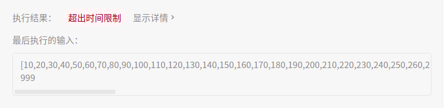

## 377. 组合总和 Ⅳ

## 题目

给你一个由 不同 整数组成的数组 nums ，和一个目标整数 target 。请你从 nums 中找出并返回总和为 target 的元素组合的个数。

题目数据保证答案符合 32 位整数范围。

```java
示例 1：

输入：nums = [1,2,3], target = 4
输出：7
解释：
所有可能的组合为：
(1, 1, 1, 1)
(1, 1, 2)
(1, 2, 1)
(1, 3)
(2, 1, 1)
(2, 2)
(3, 1)
请注意，顺序不同的序列被视作不同的组合。
示例 2：

输入：nums = [9], target = 3
输出：0
```

```java
提示：

1 <= nums.length <= 200
1 <= nums[i] <= 1000
nums 中的所有元素 互不相同
1 <= target <= 1000
```


进阶：如果给定的数组中含有负数会发生什么？问题会产生何种变化？如果允许负数出现，需要向题目中添加哪些限制条件？


链接：https://leetcode-cn.com/problems/combination-sum-iv

## 解题记录

+ 考虑使用回溯方法做，通过回溯找到所有可能的情况
+ 然后通过排列组合算出每一种情况的组合情况，最后加和


```java
/**
 * @author: ffzs
 * @Date: 2021/4/24 上午10:04
 */
public class Solution {

    int[] nums;
    int target;
    int[] counter;
//    List<Integer> list = new ArrayList<>();
    int res = 0;

    public int combinationSum4(int[] nums, int target) {
        this.nums = nums;
        this.target = target;
        this.counter = new int[nums.length];
        Arrays.sort(this.nums);

        dfs(0, 0);
        return res;
    }

    private void dfs(int sum, int i) {
        if (sum >= target) {
            if (sum == target) deal();
            return;
        }
        for (int j = i; j < nums.length; j++) {
            int num = nums[j];
            if (sum + num <= target) {
                sum += num;
//                list.add(num);
                counter[j]++;
                dfs(sum, j);
                counter[j]--;
//                list.remove(list.size() - 1);
                sum -= num;
            }
        }
    }

    private void deal() {
        int sum = 0, cnt = 0;
        for (int i : counter) {
            if (i != 0) {
                cnt ++;
                sum += i;
            }
        }
        int ret = 1;
//        System.out.println(list);
        for (int i = 0; i < counter.length && cnt > 1; i++) {
            if (counter[i] != 0 && sum > 1) {
                ret *= combinations(sum, counter[i]);
//                System.out.println("a,b : " + sum + ", " + counter[i] + "   res:" + ret);
                sum -= counter[i];
                cnt--;
            }
        }

        res += ret;
    }

    private int combinations(int a, int b) {
        // 这里可以判断 a， b 重合部分(a-b)>b的情况， 去掉重复部分
        if (b > a-b) b = a-b;
        long up = 1, down = 1;
        for (int i = 0; i < b; i++) {
            up *= (a - i);
            down *= (b - i);
        }
        return (int) (up / down);
    }
}

class Test {
    public static void main(String[] args) {
        Solution solution = new Solution();
//        int[] nums = {1,50};
        int[] nums = {5,1,8};
        System.out.println(solution.combinationSum4(nums, 24));
    }
}
```

****

+ 通过动态规划解题，背包问题
+ $dp[i]$代表目标为i的时候，有多少种排列组合方式
+ $nums = 1,2,3, target = 4$的情况，4可以通过$3+1, 即dp[3]$得到，一可以通过$2+2, 即dp[2]$得到，同样也可以通过$1+3, 即dp[1]$得到
+ 因此$dp[4] = dp[1] + dp[2] + dp[3]$, 也就是说$dp[target] = \sum dp[target-num], num \in nums $

```java
/**
 * @author: ffzs
 * @Date: 2021/4/24 上午11:50
 */
public class Solution2 {
    public int combinationSum4(int[] nums, int target) {
        int[] dp = new int[target+1];
        Arrays.sort(nums);
        dp[0] = 1;
        for (int i = nums[0]; i <= target; i++) {
            for (int num : nums) {
                if (num <= i) dp[i] += dp[i-num];
            }
        }
        return dp[target];
    }
}
```

