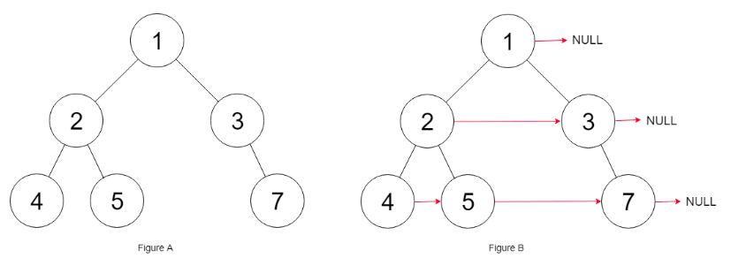

## [117. 填充每个节点的下一个右侧节点指针 II](https://leetcode-cn.com/problems/populating-next-right-pointers-in-each-node-ii/)

## 题目

给定一个二叉树

```java
struct Node {
  int val;
  Node *left;
  Node *right;
  Node *next;
}
```


填充它的每个 next 指针，让这个指针指向其下一个右侧节点。如果找不到下一个右侧节点，则将 next 指针设置为 NULL。

初始状态下，所有 next 指针都被设置为 NULL。

 

进阶：

你只能使用常量级额外空间。
使用递归解题也符合要求，本题中递归程序占用的栈空间不算做额外的空间复杂度。


示例：



```java
输入：root = [1,2,3,4,5,null,7]
输出：[1,#,2,3,#,4,5,7,#]
解释：给定二叉树如图 A 所示，你的函数应该填充它的每个 next 指针，以指向其下一个右侧节点，如图 B 所示。
```

```java
提示：

树中的节点数小于 6000
-100 <= node.val <= 100
```


链接：https://leetcode-cn.com/problems/populating-next-right-pointers-in-each-node-ii

## 解题记录

+ 层序遍历		
+ 通过记录下来每层前一个的node，将前一个的next指定为本node
+ 如果是每层的最后一个指定next为null

```java
/**
 * @author: ffzs
 * @Date: 2020/9/28 上午7:44
 */


class Node {
    public int val;
    public Node left;
    public Node right;
    public Node next;

    public Node() {}

    public Node(int _val) {
        val = _val;
    }

    public Node(int _val, Node _left, Node _right, Node _next) {
        val = _val;
        left = _left;
        right = _right;
        next = _next;
    }
}

public class Solution {
    public Node connect(Node root) {
        if (root == null) return null;
        Deque<Node> queue = new LinkedList<>();
        root.next = null;
        queue.offer(root);
        Node pre = root,current;
        while (!queue.isEmpty()) {
            int size = queue.size();
            for (int i = 0; i < size; i++) {
                current = queue.poll();
                if (i == 0) {
                    pre = current;
                }
                else{
                    pre.next=current;
                    pre = current;
                }
                assert current != null;
                if (i == size-1) {
                    current.next = null;
                }
                System.out.println(current.val);
                if (current.left != null) queue.offer(current.left);
                if (current.right != null) queue.offer(current.right);
            }
        }
        return root;
    }
}
```


## 进阶

+ 使用反向后序遍历
+ 通过map记录每一层的情况

```java
/**
 * @author: ffzs
 * @Date: 2020/9/28 上午8:19
 */
public class Solution2 {

    Map<Integer, Node> map = new HashMap<>();
    public Node connect(Node root) {
        dfs(root, 0);
        return root;
    }

    private void dfs (Node root, int level) {
        if (root != null) {

            dfs(root.right, level+1);
            dfs(root.left, level+1);

            root.next = map.getOrDefault(level, null);
            map.put(level, root);
        }
    }
}
```


## 再进阶

+ 通过前序遍历
+ 每层获取左右树的情况，如果有左右树的话，将左树的next指向右树
+ 获取子代层需要指定next的节点，有右树肯定是右树，没有则为左树
+ 通过父节点的next获取下一层的目前最左一个节点
+ 将子代中需要指定的节点的next指定为上一步找到的节点
+ 这样子代层的next就打通了，再继续递归下去，注意要先右后左


```java
/**
 * @author: ffzs
 * @Date: 2020/9/28 上午8:55
 */
public class Solution3 {

    public Node connect(Node root) {
        if (root == null) return null;
        dfs(root);
        return root;
    }

    private void dfs (Node root) {
        if (root.left == null && root.right == null) return;
        Node cur = root.right;
        if (root.left != null && root.right != null) {
            root.left.next = root.right;
        } else if (root.right == null) {
            cur = root.left;
        }

        Node rootNext = root.next;
        Node next = null;
        while (rootNext != null && next ==null) {
            if (rootNext.left != null || rootNext.right != null) {
                next = rootNext.left == null? rootNext.right : rootNext.left;
            }
            rootNext = rootNext.next;
        }

        cur.next = next;
        if (root.right != null) dfs(root.right);
        if (root.left != null) dfs(root.left);
    }
}
```

