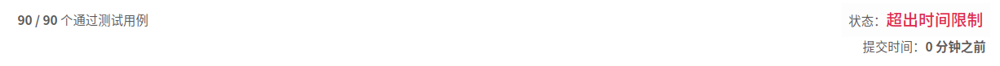

## [696. 计数二进制子串](https://leetcode-cn.com/problems/count-binary-substrings/)

## 题目

给定一个字符串 s，计算具有相同数量0和1的非空(连续)子字符串的数量，并且这些子字符串中的所有0和所有1都是组合在一起的。

重复出现的子串要计算它们出现的次数。

```java
示例 1 :

输入: "00110011"
输出: 6
解释: 有6个子串具有相同数量的连续1和0：“0011”，“01”，“1100”，“10”，“0011” 和 “01”。

请注意，一些重复出现的子串要计算它们出现的次数。

另外，“00110011”不是有效的子串，因为所有的0（和1）没有组合在一起。
```

```java
示例 2 :

输入: "10101"
输出: 4
解释: 有4个子串：“10”，“01”，“10”，“01”，它们具有相同数量的连续1和0。
```

```java
注意：

s.length 在1到50,000之间。
s 只包含“0”或“1”字符。
```


链接：https://leetcode-cn.com/problems/count-binary-substrings

## 解题记录

+ 暴力解法，通过便利字符串，以每一个字符串为开头，判断之后是否符合条件，符合的话result+1

```java
/**
 * @author: ffzs
 * @Date: 2020/8/10 上午7:31
 */
public class Solution {
    public int countBinarySubstrings(String s) {
        char[] chars = s.toCharArray();
        int res = 0;
        for (int i = 0; i < s.length(); i++) {
            if (isBinary(chars, i)) res++;
        }
        return res;
    }

    private boolean isBinary (char[] c, int i) {
        int count = 0;
        char first = c[i];
        while(i < c.length && c[i] == first) {
            count++;
            i++;
        }
        while (i < c.length && c[i] != first) {
            count--;
            i++;
        }
        return count <= 0;
    }
}
```



但是结果超时

+ 换个思路，不需要每个都判断是否符合情况，这样如果有特别长的相同字符出现就会很费时间
+ 为了判断是否成对，只要对之前出现过的字符做记录，如果当前是0的话，只要比较当前0的个数和之前1的数值即可，每次切换0,1将记录刷新

```java
/**
 * @author: ffzs
 * @Date: 2020/8/10 上午8:00
 */
public class Solution2 {

    public int countBinarySubstrings(String s) {
        int len = s.length();
        int res = 0, count0 = 0, count1 = 0;
        boolean is0 = true;

        for (int i = 0; i < len; i++) {
            if (s.charAt(i) == '0') {
                if (!is0){
                    is0 = true;
                    count0 = 0;
                }
                count0 ++;
                if (count0 <= count1) res ++;
            }
            else {
                if (is0){
                    is0 = false;
                    count1 = 0;
                }
                count1++;
                if (count1 <= count0) res ++;
            }
        }
        return res;
    }
}
```

