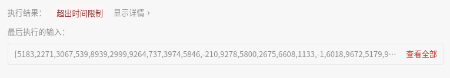
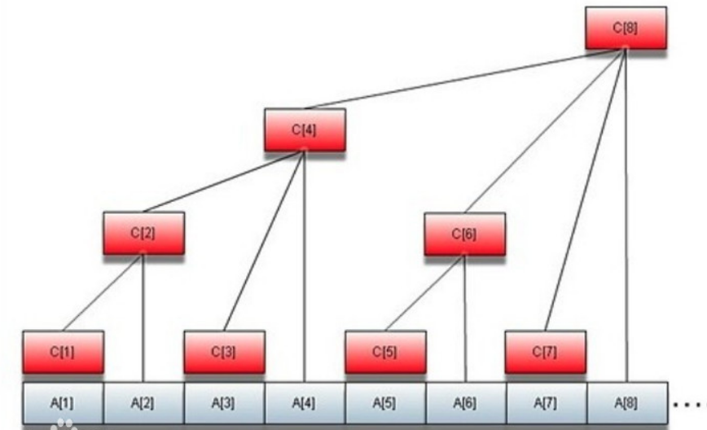
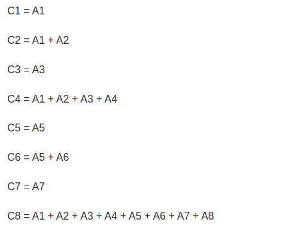
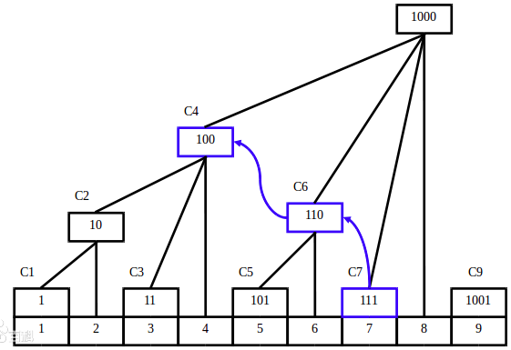

## [315. 计算右侧小于当前元素的个数](https://leetcode-cn.com/problems/count-of-smaller-numbers-after-self/)

## 题目

给定一个整数数组 nums，按要求返回一个新数组 counts。数组 counts 有该性质： counts[i] 的值是  nums[i] 右侧小于 nums[i] 的元素的数量。

```java
示例:

输入: [5,2,6,1]
输出: [2,1,1,0] 
解释:
5 的右侧有 2 个更小的元素 (2 和 1).
2 的右侧仅有 1 个更小的元素 (1).
6 的右侧有 1 个更小的元素 (1).
1 的右侧有 0 个更小的元素.
```


链接：https://leetcode-cn.com/problems/count-of-smaller-numbers-after-self

## 解题记录

+ 暴力解法
+ 直接双重循环一个一个对比

```java
/**
 * @author ffzs
 * @describe
 * @date 2020/7/11
 */
public class Solution {
    public static List<Integer> countSmaller(int[] nums) {
        int len = nums.length;
        int[] counter = new int[len];

        for (int i = len-2; i >=0 ; --i) {
            for (int j = i+1; j < len; ++j) {
                if (nums[j] < nums[i]) counter[i]++;
            }
        }
        List<Integer> res = new ArrayList<>(len);
        for (int i : counter) res.add(i);
        return res;
    }

    public static void main(String[] args) {
        int[] nums = {5,2,6,1};
        System.out.println(countSmaller(nums));
    }
}

```

不出所料，超时



+ 从后向前遍历muns，使用排序数组list记录遍历过的数据
+ 通过二分法找在list中找到小于目标数值的位置，也就是小于目标值的个数
+ 为了维持排序状态，将目标数插入到获得的位置

```java
/**
 * @author ffzs
 * @describe
 * @date 2020/7/11
 */
public class Solution2 {
    public static List<Integer> countSmaller(int[] nums) {
        int len = nums.length;
        if (len == 0) return new ArrayList<>();
        int[] counter = new int[len];
        List<Integer> sorted = new ArrayList<>();
        sorted.add(nums[len-1]);
        for (int i = len-2; i >=0 ; --i) {
            int index = findIndex(nums[i], sorted);
            sorted.add(index, nums[i]);
            counter[i] = index;
        }
        List<Integer> res = new ArrayList<>(len);
        for (int i : counter) res.add(i);
        return res;
    }

    private static int findIndex (int num, List<Integer> sorted) {
        int l = 0, r = sorted.size()-1;
        while (l < r) {
            int mid = (l + r) >> 1;
            if (sorted.get(mid) < num) l = mid + 1;
            else r = mid;
        }
        return sorted.get(l) < num ? l + 1: l;
    }

    public static void main(String[] args) {
        int[] nums = {26,78,27,100,33,67,90,23,66,5,38,7,35,23,52,22,83,51,98,69,81,32,78,28,94,13,2,97,3,76,99,51,9,21,84,66,65,36,100,41};
        System.out.println(countSmaller(nums));
    }
}

```


## 进阶 归并

+ 这个题目可以理解为将数组排序，每个数向后交换几次可以获得排好序的数组，[5,2,6,1]的结果[2,1,1,0] 
  1.  1 向后移动 0 得到[5,2,6,1]
  2.  6向后移动1 得到 [5,2,1,6]
  3.  2向后移动1 得到 [5,1,2,6]
  4.  5向后移动2 得到 [1,2,5,6]
+ 可通过归并排序过程中，记录数组中数字向后移动情况来确定最后取值

```java
/**
 * @author ffzs
 * @describe
 * @date 2020/7/11
 */
public class Solution3 {
    static int[] ns, tmp, is, ctr;
    public static List<Integer> countSmaller(int[] nums) {
        int len = nums.length;
        if (len == 0) return new ArrayList<>();
        ctr = new int[len];
        tmp = new int[len];
        is = new int[len];
        for (int i = 0; i < len; i++) is[i] = i;
        ns = nums;
        split(0, len-1);
        List<Integer> res = new ArrayList<>(len);
        for (int i : ctr) res.add(i);
        return res;
    }

    private static void split (int l, int r) {
        if (l == r) return;
        int mid = l + r >> 1;
        split(l, mid);
        split(mid+1, r);
        if (ns[is[mid]] > ns[is[mid+1]]) merge(l ,mid ,r);
    }

    private static void merge (int l, int mid , int r) {
        if (r + 1 - l >= 0) System.arraycopy(is, l, tmp, l, r + 1 - l);
        int i = l, j = mid + 1;
        for (int k = l; k <= r; ++k) {
            if (j > r) {
                ctr[tmp[i]] += r - mid;
                is[k] = tmp[i++];
            }
            else if (i > mid)
                is[k] = tmp[j++];
            else if (ns[tmp[i]] <= ns[tmp[j]]) {
                ctr[tmp[i]] += k - i;
                is[k] = tmp[i++];
            }
            else
                is[k] = tmp[j++];
        }
    }

    public static void main(String[] args) {
        int[] nums = {26,78,27,100,33,67,90,23,66,5,38,7,35,23,52,22,83,51,98,69,81,32,78,28,94,13,2,97,3,76,99,51,9,21,84,66,65,36,100,41};
        System.out.println(countSmaller(nums));
    }
}
```


## 进阶 树状数组



+ C 表示数组的前缀和 关系如下：



+ 将C数组节点序号转化为二进制



+ 查询区间

![[公式]](https://www.zhihu.com/equation?tex=%5Cbegin%7Barray%7D%7Blcl%7D+i+%3D+7%5C%5C+sum_7+%3D+%5Csum_%7Bi+%3D+1%7D+%5E+7A_i%5C%5C+sum_7+%3D+C_4+%2B+C_6+%2B+C_7%5C%5C+sum_%7B%28111%29_2%7D+%3D+C_%7B%28100%29_2%7D%2BC_%7B%28110%29_2%7D%2BC_%7B%28111%29_2%7D+%5Cend%7Barray%7D)

```java
    public static int sum(int value, int[] BITree) { 
        int sum = 0;
        while (value > 0) {
            sum += BITree[value];
            value -= (value & -value);
        }
        return sum;
    }
```

+ 单点更新

```java
    public static void update(int value, int[] BITree) {
        while (value <= BITree.length - 1) {
            BITree[value] += 1;
            value += (value & -value);
        }
    }
```

+ 通过桶统计之前出现数字的情况和个数通过树状数组进行存储，更新
+ 统计个数通过查询区间获取小于目标数字的个数和


```java
/**
 * @author ffzs
 * @describe
 * @date 2020/7/11
 */
public class Solution {
    public static List<Integer> countSmaller(int[] nums) {
        int len = nums.length;
        List<Integer> res = new ArrayList<>();
        if (len == 0) return res;
        int[] counter = new int[len];
        int min = nums[0];
        for (int num : nums) min = Math.min(min, num);
        for (int i = 0; i < nums.length; i++) {
            nums[i] = nums[i] - min + 1;
        }
        int max = nums[0];
        for (int num : nums) max = Math.max(max, num);
        int[] BIT = new int[max + 1];
        for (int i = nums.length - 1; i >= 0; i--) {
            int count = sum(nums[i]-1, BIT);
            counter[i] = count;
            update(nums[i], BIT);
        }
        for (int i : counter) res.add(i);
        return res;
    }

    private static int lowBit (int val) {
        return (val & -val);
    }

    private static int sum (int val, int[] BIT){
        int sum = 0;
        for (int i = val; i > 0; i -= lowBit(i)) {
            sum += BIT[i];
        }
        return sum;
    }

    private static void update (int val, int[] BIT){
        for (int i = val; i < BIT.length - 1; i += lowBit(i)) {
            BIT[i] += 1;
        }
    }

    public static void main(String[] args) {
        int[] nums = {5,2,6,1};
        System.out.println(countSmaller(nums));
    }
}

```

