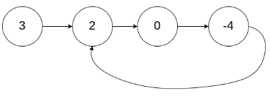
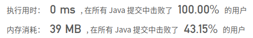

## [142. 环形链表 II](https://leetcode-cn.com/problems/linked-list-cycle-ii/)

## 题目

给定一个链表，返回链表开始入环的第一个节点。 如果链表无环，则返回 null。

为了表示给定链表中的环，我们使用整数 pos 来表示链表尾连接到链表中的位置（索引从 0 开始）。 如果 pos 是 -1，则在该链表中没有环。

说明：不允许修改给定的链表。

 

```java
示例 1：

输入：head = [3,2,0,-4], pos = 1
输出：tail connects to node index 1
解释：链表中有一个环，其尾部连接到第二个节点。
```



**进阶：**
你是否可以不用额外空间解决此题？


链接：https://leetcode-cn.com/problems/linked-list-cycle-ii


## 解题记录

+ 为了不是用额外的空间，本题仍然使用快慢指针
+ 解法参照[Leetcode: NO.287 寻找重复数 快慢指针](https://blog.csdn.net/tonydz0523/article/details/106347320)

```java
/**
 * @author: ffzs
 * @Date: 2020/10/10 上午8:20
 */

class ListNode {
    int val;
    ListNode next;
    ListNode(int x) {
        val = x;
        next = null;
    }
}

public class Solution {

    public ListNode detectCycle(ListNode head) {
        if (head == null ) return null;
        ListNode fast = head;
        ListNode slow = head;
        while (fast.next != null && fast.next.next != null) {
            fast = fast.next.next;
            slow = slow.next;
            if (fast == slow)
                break;
        }

        if (fast.next == null || fast.next.next == null) return null;
        slow = head;
        while (fast!= slow) {
            fast = fast.next;
            slow = slow.next;
        }
        return slow;
    }
}

class Test {
    public static void main(String[] args) {
        Solution solution = new Solution();
        ListNode head = new ListNode(3);
        ListNode cross = new ListNode(2);
        head.next = cross;
        cross.next = new ListNode(0);
        cross.next.next = new ListNode(-4);
        cross.next.next.next = cross;
        System.out.println(solution.detectCycle(head));
    }
}
```

