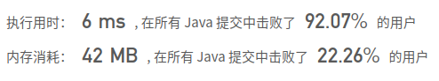

## [79. 单词搜索](https://leetcode-cn.com/problems/word-search/)

## 题目

给定一个二维网格和一个单词，找出该单词是否存在于网格中。

单词必须按照字母顺序，通过相邻的单元格内的字母构成，其中“相邻”单元格是那些水平相邻或垂直相邻的单元格。同一个单元格内的字母不允许被重复使用。

 

```java
示例:

board =
[
  ['A','B','C','E'],
  ['S','F','C','S'],
  ['A','D','E','E']
]

给定 word = "ABCCED", 返回 true
给定 word = "SEE", 返回 true
给定 word = "ABCB", 返回 false
```


```java
提示：

board 和 word 中只包含大写和小写英文字母。
1 <= board.length <= 200
1 <= board[i].length <= 200
1 <= word.length <= 10^3
```


链接：https://leetcode-cn.com/problems/word-search


## 解题记录

+ 回溯
+ 直接通过循环整个表找到第一个为出发点
+ 之后将判断出发点的四周有没有下一个字符，有的话换成'#'
+ 进入递归，直到word遍历完，返回true，否则false

```java
/**
 * @author: ffzs
 * @Date: 2020/9/13 上午7:07
 */
public class Solution {
    int n, m;
    char[][] step;
    char[] seq;
    boolean isExist = false;
    int[][] direction = {{1,0}, {-1,0}, {0, 1}, {0,-1}};
    public boolean exist(char[][] board, String word) {
        n = board.length;
        m = board[0].length;
        step = board;
        seq = word.toCharArray();
        for (int i = 0; i < n; i++) {
            for (int j = 0; j < m; j++) {
                if (!isExist && seq[0] == step[i][j]) {
                    step[i][j] = '#';
                    dfs (1, i, j);
                    step[i][j] = seq[0];
                }
            }
        }
        return isExist;
    }


    private void dfs (int index, int i, int j) {
        if (!isExist) {
            if (index == seq.length) {
                isExist = true;
                return;
            }
            for (int[] dt : direction) {
                int ii = dt[0]+i;
                int jj = dt[1]+j;
                if (inRule(ii, jj) && step[ii][jj]== seq[index]) {
                    step[ii][jj] = '#';
                    dfs(index+1, ii, jj);
                    step[ii][jj] = seq[index];
                }
            }
        }
    }

    private boolean inRule (int i, int j) {
        return i>=0 && i<n && j>=0 && j<m;
    }
}

class Test {
    public static void main(String[] args) {
        char[][] board = {{'A','B','C','E'},{'S','F','C','S'},{'A','D','E','E'}};
        Solution solution = new Solution();
        System.out.println(solution.exist(board, "ABCCED"));
    }
}
```

