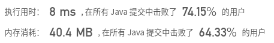

## [332. 重新安排行程](https://leetcode-cn.com/problems/reconstruct-itinerary/)

## 题目

给定一个机票的字符串二维数组 [from, to]，子数组中的两个成员分别表示飞机出发和降落的机场地点，对该行程进行重新规划排序。所有这些机票都属于一个从 JFK（肯尼迪国际机场）出发的先生，所以该行程必须从 JFK 开始。

```java
说明:

如果存在多种有效的行程，你可以按字符自然排序返回最小的行程组合。例如，行程 ["JFK", "LGA"] 与 ["JFK", "LGB"] 相比就更小，排序更靠前
所有的机场都用三个大写字母表示（机场代码）。
假定所有机票至少存在一种合理的行程。
```


```java
示例 1:

输入: [["MUC", "LHR"], ["JFK", "MUC"], ["SFO", "SJC"], ["LHR", "SFO"]]
输出: ["JFK", "MUC", "LHR", "SFO", "SJC"]
```


```java
示例 2:

输入: [["JFK","SFO"],["JFK","ATL"],["SFO","ATL"],["ATL","JFK"],["ATL","SFO"]]
输出: ["JFK","ATL","JFK","SFO","ATL","SFO"]
解释: 另一种有效的行程是 ["JFK","SFO","ATL","JFK","ATL","SFO"]。但是它自然排序更大更靠后。
```


链接：https://leetcode-cn.com/problems/reconstruct-itinerary

## 解题记录

+ 由于可能出现多种情况使用回溯算法
+ 首先构建飞机的映射表，用来找到机票的目的地
+ 由于多重情况下需要按照字符顺序排，因此需要map中list数据排序

```java
/**
 * @author: ffzs
 * @Date: 2020/8/27 上午8:04
 */

public class Solution {
    Map<String, List<String>> map = new HashMap<>();
    boolean flag = false;
    List<String> res = new ArrayList<>();
    public List<String> findItinerary(List<List<String>> tickets){
        for (List<String> ticket : tickets) {
            if (map.containsKey(ticket.get(0))) map.get(ticket.get(0)).add(ticket.get(1));
            else {
                map.put(ticket.get(0), new ArrayList<>(List.of(ticket.get(1))));
            }
        }
        for (String s : map.keySet()) {
            map.get(s).sort(Comparator.naturalOrder());
        }
        String airport = "JFK";
        findItinerary(airport, tickets.size(), new ArrayList<>(List.of(airport)));
        return res;
    }

    private void findItinerary (String airport, int times, List<String> list){
        if (times==0 && !flag) {
            res = new ArrayList<>(list); flag = true;
            return;
        }

        if (map.get(airport)!=null&&!map.get(airport).isEmpty()) {
            List<String> tmp = map.get(airport);
            int size = map.get(airport).size();
            for (int i = 0; i < size; i++) {
                String nextAirport = tmp.remove(0);
                list.add(nextAirport);
                if (!flag) findItinerary(nextAirport, times-1, list);
                list.remove(list.size()-1);
                tmp.add(nextAirport);
            }
        }
    }
}

class Test {
    public static void main(String[] args) {
        String[][] it = {{"CBR","JFK"},{"TIA","EZE"},{"AUA","TIA"},{"JFK","EZE"},{"BNE","CBR"},{"JFK","CBR"},{"CBR","AUA"},{"EZE","HBA"},{"AXA","ANU"},{"BNE","EZE"},{"AXA","EZE"},{"AUA","ADL"},{"OOL","JFK"},{"BNE","AXA"},{"OOL","EZE"},{"EZE","ADL"},{"TIA","BNE"},{"EZE","TIA"},{"JFK","AUA"},{"AUA","EZE"},{"ANU","ADL"},{"TIA","BNE"},{"EZE","OOL"},{"ANU","BNE"},{"EZE","ANU"},{"ANU","AUA"},{"BNE","ANU"},{"CNS","JFK"},{"TIA","ADL"},{"ADL","AXA"},{"JFK","OOL"},{"AUA","ADL"},{"ADL","TIA"},{"ADL","ANU"},{"ADL","JFK"},{"BNE","EZE"},{"ANU","BNE"},{"JFK","BNE"},{"EZE","AUA"},{"EZE","AXA"},{"AUA","TIA"},{"ADL","CNS"},{"AXA","AUA"}};
        List<List<String>> tickets = new ArrayList<>();
        for (String[] str : it) {
            tickets.add(Arrays.asList(str));
        }
        Solution solution = new Solution();
        System.out.println(solution.findItinerary(tickets));
    }
}
```


+ 使用深度优先算法优化
+ 一直获取直到map中不再出有值，开始写入
+ 不过写入list的顺序是反的

```java
/**
 * @author: ffzs
 * @Date: 2020/8/27 上午10:42
 */
public class Solution2 {
    Map<String, List<String>> map = new HashMap<>();
    List<String> res = new ArrayList<>();
    public List<String> findItinerary(List<List<String>> tickets){
        for (List<String> ticket : tickets) {
            if (!map.containsKey(ticket.get(0))) map.put(ticket.get(0), new ArrayList<>());
            map.get(ticket.get(0)).add(ticket.get(1));
        }
        for (String s : map.keySet()) {
            map.get(s).sort(Comparator.naturalOrder());
        }
        dfs("JFK");
        return res;
    }

    private void  dfs (String airport) {
        List<String> tmp = map.get(airport);
        while (tmp!=null && !tmp.isEmpty()) {
            String nextAirport = tmp.remove(0);
            dfs(nextAirport);
        }
        res.add(0,airport);
    }
}
```



+ map中的list换成可以自动排序的`PriorityQueue`
+ 返回的list换成插入速度快的LinkedList

```java
/**
 * @author: ffzs
 * @Date: 2020/8/27 上午10:51
 */
public class Solution3 {
    Map<String, PriorityQueue<String>> map = new HashMap<>();
    LinkedList<String> res = new LinkedList<>();
    public List<String> findItinerary(List<List<String>> tickets){
        for (List<String> ticket : tickets) {
            if (!map.containsKey(ticket.get(0))) map.put(ticket.get(0), new PriorityQueue<>());
            map.get(ticket.get(0)).offer(ticket.get(1));
        }
        dfs("JFK");
        return res;
    }

    private void  dfs (String airport) {
        PriorityQueue<String> tmp = map.get(airport);
        while (tmp!=null && !tmp.isEmpty()) {
            dfs(tmp.poll());
        }
        res.addFirst(airport);
    }
}
```


可能数据量小，优化效果看不出来。