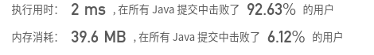
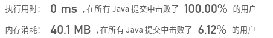

## [215. 数组中的第K个最大元素](https://leetcode-cn.com/problems/kth-largest-element-in-an-array/)

## 题目

在未排序的数组中找到第 k 个最大的元素。请注意，你需要找的是数组排序后的第 k 个最大的元素，而不是第 k 个不同的元素。

```java
示例 1:

输入: [3,2,1,5,6,4] 和 k = 2
输出: 5
```

```java
示例 2:

输入: [3,2,3,1,2,4,5,5,6] 和 k = 4
输出: 4
```

```java
说明:

你可以假设 k 总是有效的，且 1 ≤ k ≤ 数组的长度。
```


链接：https://leetcode-cn.com/problems/kth-largest-element-in-an-array


## 解题记录

+ 直接通过api进行排序
+ 取排序后数组后k个

```java
/**
 * @author ffzs
 * @describe
 * @date 2020/6/29
 */
public class Solution {
    public int findKthLargest(int[] nums, int k) {
        Arrays.sort(nums);
        return nums[nums.length-k];
    }
}
```



## 进阶

+ 通过使用二分查找的快速排序进行确定第K大的数
+ 通过选取中间值，通过交换前后值的方法，确定一个点right，使得其为一个mid值分解线，就是说大于j的都是大于等于mid的值
+ 如果r-right大于等于k说明，K大在右边
+ 否者在左边
+ 二分递归，知道只剩一个值，left==right时，这个值便是k

```java
/**
 * @author ffzs
 * @describe
 * @date 2020/6/29
 */
public class Solution2 {
    public static int findKthLargest(int[] nums, int k) {
        return quickSort(nums, 0, nums.length - 1, k);
    }

    private static int quickSort (int[] nums, int l, int r, int k) {
        if (l == r) return nums[l];
        int mid = nums[l+r >> 1];
        int left = l, right = r;
        while (true) {
            while (nums[left] < mid) left ++;
            while (nums[right] > mid) right --;
            if (left < right) swap(nums, left++, right--);
            else break;
        }
        if (r-right>=k) return quickSort(nums, right +1, r, k);
        else return quickSort(nums, l, right, k-(r-right));
    }

    private static void swap (int[] nums, int i, int j) {
        int tmp = nums[i];
        nums[i] = nums[j];
        nums[j] = tmp;
    }

    public static void main(String[] args) {
        int[] nums = {3,2,3,1,2,4,5,5,6};
        System.out.println(findKthLargest(nums, 4));
    }
}
```

