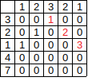

## [718. 最长重复子数组](https://leetcode-cn.com/problems/maximum-length-of-repeated-subarray/)

## 题目

给两个整数数组 A 和 B ，返回两个数组中公共的、长度最长的子数组的长度。

```java
示例 1:

输入:
A: [1,2,3,2,1]
B: [3,2,1,4,7]
输出: 3
解释: 
长度最长的公共子数组是 [3, 2, 1]。
```


```java
说明:

1 <= len(A), len(B) <= 1000
0 <= A[i], B[i] < 100
```


链接：https://leetcode-cn.com/problems/maximum-length-of-repeated-subarray

## 解题记录

+ 通过构建B的映射表，数值和index的关系
+ 通过循环遍历A获取B中位置进行比较获取最长

```java
/**
 * @author ffzs
 * @describe
 * @date 2020/7/1
 */
public class Solution {
    public static int findLength(int[] A, int[] B) {
        int res = 0;
        Map<Integer, List<Integer>> map = new HashMap<>();
        for (int i = 0; i < B.length; i++) {
            if (!map.containsKey(B[i])) {
                List<Integer> lst = new ArrayList<>();
                lst.add(i);
                map.put(B[i], lst);
            }
            else {
                map.get(B[i]).add(i);
            }
        }

        for (int i = 0; i < A.length; i++) {
            if (map.containsKey(A[i]) && i+res < A.length) {
                for (Integer it : map.get(A[i])) {
                    res = Math.max(res, matchLen(A, B, i, it));
                }
            }
        }
        return res;
    }

    private static int matchLen (int[] A, int[] B, int sa, int sb) {
        int len = 0;
        int i = sa, j = sb;
        while (i < A.length && j < B.length) {
            if (A[i++] == B[j++]) {
                len ++;
            }
            else break;
        }
        return len;
    }

    public static void main(String[] args) {
        int[] A = {1,2,3,2,1};
        int[] B = {3,2,1,4,7};
//        System.out.println(matchLen(A, B, 0, 1));
        System.out.println(findLength(A, B));
    }
}

```


因为会有连续重复的情况出现，这时每一个重复的都进行比对的话就比较费时

## 动态规划

+ 通过动态规划
+ `dp[i][j]=dp[i-1][j-1] + 1`
+ 每次获得之后更新res值
+ 如果从后向前比较的话可以只需要上一层的dp值，因此可以使用`dp[]`代替`dp[][]`



```java
/**
 * @author ffzs
 * @describe
 * @date 2020/7/1
 */
public class Solution3 {
    public static int findLength(int[] A, int[] B) {
        int res = 0;
        int[] dp = new int[B.length + 1];
        for (int i = 0; i < A.length; i++) {
            for (int j = B.length; j >= 1 ; --j) {
                if (A[i] == B[j-1]) {
                    dp[j] = dp[j-1] + 1;
                    res = Math.max(dp[j], res);
                }
                else dp[j] = 0;
            }
        }
        return res;
    }

    public static void main(String[] args) {
        int[] A = {1,2,3,2,1};
        int[] B = {3,2,1,4,7};
        System.out.println(findLength(A, B));
    }
}

```


## 滑动窗口

+ 通过移动A进行错位，两数组重合部分为窗口
+ 对窗口中的两个数组进行匹配，获得每个窗口的最大匹配个数
+ 进而获得总的最大

```java
/**
 * @author ffzs
 * @describe
 * @date 2020/7/1
 */
public class Solution4 {
    public static int findLength(int[] A, int[] B) {
        int res = 0;
        // 保证 A 短
        if (A.length > B.length) {
            int[] tmp = A;
            A = B;
            B = tmp;
        }

        int ia = A.length - 1, ib = 0 , len = 1;

        while (ib != B.length) {
            if (len > res) res = Math.max(matchLen(A, B, ia, ib, len), res);
            if (ib == 0 && ia != 0){
                ia --;
                len = A.length - ia;
            }
            else {
                ib++;
                len = Math.min(A.length, B.length-ib);
            }
        }
        return res;
    }

    private static int matchLen (int[] A, int[] B, int ai, int bi, int len) {
        int count = 0, ret = 0;
        for (int i = 0; i < len; i++) {
            if (A[ai + i] == B[bi + i]){
                count++;
                ret = Math.max(ret, count);
            }
            else count = 0;
        }
        return ret;
    }

    public static void main(String[] args) {
        int[] A = {1,2,3,2,1};
        int[] B = {3,2,1,4,7};
        System.out.println(findLength(A, B));
    }
}
```

