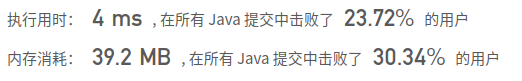
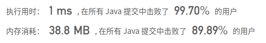

## [685. 冗余连接 II](https://leetcode-cn.com/problems/redundant-connection-ii/)

## 题目

在本问题中，有根树指满足以下条件的有向图。该树只有一个根节点，所有其他节点都是该根节点的后继。每一个节点只有一个父节点，除了根节点没有父节点。

输入一个有向图，该图由一个有着N个节点 (节点值不重复1, 2, ..., N) 的树及一条附加的边构成。附加的边的两个顶点包含在1到N中间，这条附加的边不属于树中已存在的边。

结果图是一个以边组成的二维数组。 每一个边 的元素是一对 [u, v]，用以表示有向图中连接顶点 u 和顶点 v 的边，其中 u 是 v 的一个父节点。

返回一条能删除的边，使得剩下的图是有N个节点的有根树。若有多个答案，返回最后出现在给定二维数组的答案。

```java
示例 1:

输入: [[1,2], [1,3], [2,3]]
输出: [2,3]
解释: 给定的有向图如下:
  1
 / \
v   v
2-->3
```


```java
示例 2:

输入: [[1,2], [2,3], [3,4], [4,1], [1,5]]
输出: [4,1]
解释: 给定的有向图如下:
5 <- 1 -> 2
     ^    |
     |    v
     4 <- 3
```


```java
注意:

二维数组大小的在3到1000范围内。
二维数组中的每个整数在1到N之间，其中 N 是二维数组的大小。
```


链接：https://leetcode-cn.com/problems/redundant-connection-ii

## 解题记录

+ 题目中说 每一个节点只有一个父节点，除了根节点没有父节点
+ 多出的线可以导致一个节点有两个父节点，或是出现环，因此一共三种情况：
  + 既有环又有双父节点
  + 只有双父节点
  + 只有环
+ 首先

```java
class Solution {
    public int[] findRedundantDirectedConnection(int[][] edges) {
        int n = edges.length;

        int[] tmp = new int[n+1];
        int[] step = new int[n+1];
        int aim = 0;
        int circle = 0;
        Map<Integer, List<Integer>> map = new HashMap<>();
        for (int[] edge : edges) {
            map.computeIfAbsent(edge[1], k -> new ArrayList<>());
            map.get(edge[1]).add(edge[0]);
            if (tmp[edge[1]] == 0) {
                tmp[edge[1]] ++;
            }else aim = edge[1];

            if (step[edge[0]] == 0) {
                step[edge[0]] = 1;
            }
            if (step[edge[1]] == 1) circle = edge[1];

        }

        if (circle == 0) {
            return new int[]{map.get(aim).get(1), aim};
        }
        if (aim == 0) {
            return new int[] {map.get(circle).get(0), circle};
        }
        
        step = new int[n+1];
        int start = map.get(aim).get(0);
        step[start] = 1;
        while (true) {
            if (map.containsKey(start)) start = map.get(start).get(0);
            else break;
            if (step[start] == 1) return new int[]{map.get(aim).get(0), aim};
        }
        return new int[] {map.get(aim).get(1), aim};
    }
}
```



## 优化

+ 将通过map存储的关系，通过数组存储，减少了包装耗时
+ 这里存储有个技巧就是，因为正向关系会出现一对多，但是反向关系出了出问题那个只有一对一

```java
/**
 * @author: ffzs
 * @Date: 2020/9/17 上午7:04
 */

public class Solution {
    public int[] findRedundantDirectedConnection(int[][] edges) {
        int n = edges.length;

        int[] tmp = new int[n+1];
        int[] step = new int[n+1];
        int[] aim = {0,0};
        int[] circle = {0,0};
        for (int[] edge : edges) {
            if (tmp[edge[1]] == 0) {
                tmp[edge[1]] = edge[0];
            }else aim = edge;

            if (step[edge[0]] == 0) {
                step[edge[0]] = edge[1];
            }
            if (step[edge[1]] != 0) circle = edge;
        }

        if (circle[0] == 0) {
            return aim;
        }
        if (aim[0] == 0) {
            return circle;
        }
        int start = tmp[aim[1]];
        while (true) {
            start = tmp[start];
            if (start == 0) break;
            if (start == aim[1]) return new int[] {tmp[aim[1]], aim[1]};
        }
        return aim;
    }
}

class Test {
    public static void main(String[] args) {
        Solution solution = new Solution();
        int[][] edges = {{2,1},{3,1},{4,2},{1,4}};
        System.out.println(Arrays.toString(solution.findRedundantDirectedConnection(edges)));
    }
}
```

