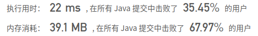
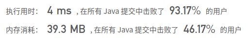

## [18. 四数之和](https://leetcode-cn.com/problems/4sum/)

## 题目

给定一个包含 n 个整数的数组 nums 和一个目标值 target，判断 nums 中是否存在四个元素 a，b，c 和 d ，使得 a + b + c + d 的值与 target 相等？找出所有满足条件且不重复的四元组。

注意：

答案中不可以包含重复的四元组。

```java
示例：

给定数组 nums = [1, 0, -1, 0, -2, 2]，和 target = 0。

满足要求的四元组集合为：
[
  [-1,  0, 0, 1],
  [-2, -1, 1, 2],
  [-2,  0, 0, 2]
]
```


链接：https://leetcode-cn.com/problems/4sum

## 解题记录

+ 通过回溯方法处理

```java
/**
 * @author: ffzs
 * @Date: 2020/10/5 上午7:06
 */
public class Solution {
    List<List<Integer>> res = new ArrayList<>();
    public List<List<Integer>> fourSum(int[] nums, int target) {
        Arrays.sort(nums);
        dfs(nums, new ArrayList<>(), 0, target);
        return res;
    }

    private void dfs(int[] nums, List<Integer> list, int start, int target){

        if (target == 0 && list.size() == 4) {
            res.add(new ArrayList<>(list));
            return;
        }

        if (list.size() < 4) {
            for (int i = start; i < nums.length; i++) {
                if (i==start || nums[i] != nums[i-1]) {
                    list.add(nums[i]);
                    target -= nums[i];
                    dfs(nums, list, i+1, target);
                    list.remove(list.size()-1);
                    target += nums[i];
                }
            }
        }
    }
}
```

超时了。。


+ 使用指针方法解题，避免重复使用set收集

```java
/**
 * @author: ffzs
 * @Date: 2020/10/5 上午7:25
 */
public class Solution2 {
    Set<List<Integer>> res = new HashSet<>();
    int[] nums;
    public List<List<Integer>> fourSum(int[] nums, int target) {
        Arrays.sort(nums);
        this.nums = nums;
        for (int i = 0; i < nums.length-3; i++) {
            for (int j = nums.length - 1; j > i+2; j--) {
                if (twoSum(i+1,j-1, target, nums[i], nums[j])<0) break;
            }
        }
        return new ArrayList<>(res);
    }

    private int twoSum (int i, int j, int target, int left, int right) {
        int ret , max = 0;
        while (i < j) {
            ret = left + right + nums[i] + nums[j] - target;
            max = Math.max(max, ret);
            if (ret>0) j--;
            else if (ret==0) {
                res.add(new ArrayList<>(List.of(left,nums[i], nums[j], right)));
                j--;
            }
            else i++;
        }
        return max;
    }
}
```



+ 通过跳过重复值的方法来避免重复，而不是使用set
+ 通过一些限制减少遍历次数，如第i和数组最大的三个数相加也小于target那么直接进行下一个，如果i以及i后面三个数相加大于target说明最小的情况都比target大了，那么直接退出


```java
/**
 * @author: ffzs
 * @Date: 2020/10/5 上午7:25
 */
public class Solution2 {
    List<List<Integer>> res = new ArrayList<>();
    int[] nums;
    public List<List<Integer>> fourSum(int[] nums, int target) {
        Arrays.sort(nums);
        this.nums = nums;
        int n = nums.length;
        for (int i = 0; i < n-3; i++) {
            if(i>0 && nums[i] == nums[i-1]) continue;
            if ((nums[i] + nums[n-1] + nums[n-2] + nums[n-3]) < target) continue;
            if ((nums[i] + nums[i+1] + nums[i+2] + nums[i+3]) > target) break;
            for (int j = i + 1; j < n - 2; j++) {
                if ((j > i+1 && nums[j] == nums[j-1])||(nums[i] + nums[j]+ nums[n-1] + nums[n-2]) < target) continue;
                if ((nums[i] + nums[j] + nums[j+1] + nums[j+2])>target) break;
                twoSum(j+1,n-1, target, nums[i], nums[j]);
            }
        }
        return res;
    }

    private void twoSum (int i, int j, int target, int left, int right) {
        while (i < j) {
            int ret = left + right + nums[i] + nums[j] - target;
            if (ret>0) j--;
            else if (ret==0) {
                res.add(Arrays.asList(left,nums[i], nums[j], right));
                while (i < j && nums[i] == nums[++i]);
                while (i < j && nums[j] == nums[--j]);
            }
            else i++;
        }
    }
}
```

