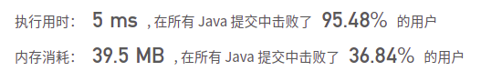

## 451. 根据字符出现频率排序

## 题目

给定一个字符串，请将字符串里的字符按照出现的频率降序排列。

```java
示例 1:
输入:
"tree"
输出:
"eert"
解释:
'e'出现两次，'r'和't'都只出现一次。
因此'e'必须出现在'r'和't'之前。此外，"eetr"也是一个有效的答案。
    
示例 2:
输入:
"cccaaa"
输出:
"cccaaa"
解释:
'c'和'a'都出现三次。此外，"aaaccc"也是有效的答案。
注意"cacaca"是不正确的，因为相同的字母必须放在一起。
    
示例 3:
输入:
"Aabb"
输出:
"bbAa"
解释:
此外，"bbaA"也是一个有效的答案，但"Aabb"是不正确的。
注意'A'和'a'被认为是两种不同的字符。
```


链接：https://leetcode-cn.com/problems/sort-characters-by-frequency

## 解题记录

+ 计数排序，优先统计每一个字符出现的次数
+ 然后通过个数进行降序处理，组成新的字符串

```java
/**
 * @author: ffzs
 * @Date: 2021/7/3 上午7:28
 */
public class Solution {

    public String frequencySort(String s) {
        int[][] counter = new int[128][2];
        for (int i = 0; i < 128; i++) {
            counter[i][0] = i;
        }

        for (char c : s.toCharArray()) {
            counter[c- ' '][1]++;
        }

        Arrays.sort(counter, (a, b)-> b[1] - a[1]);

        StringBuilder sb = new StringBuilder();
        for (int[] ints : counter) {
            if (ints[1] == 0) break;
            char c = (char) (ints[0] + ' ');
            sb.append(String.valueOf(c).repeat(Math.max(0, ints[1])));
        }
        return sb.toString();
    }

}
```




