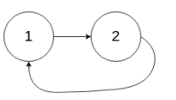

## [141. 环形链表](https://leetcode-cn.com/problems/linked-list-cycle/)

## 题目

给定一个链表，判断链表中是否有环。

如果链表中有某个节点，可以通过连续跟踪 next 指针再次到达，则链表中存在环。 为了表示给定链表中的环，我们使用整数 pos 来表示链表尾连接到链表中的位置（索引从 0 开始）。 如果 pos 是 -1，则在该链表中没有环。注意：pos 不作为参数进行传递，仅仅是为了标识链表的实际情况。

如果链表中存在环，则返回 true 。 否则，返回 false 。

 

进阶：

你能用 O(1)（即，常量）内存解决此问题吗？

 

```java
示例 1：

输入：head = [3,2,0,-4], pos = 1
输出：true
解释：链表中有一个环，其尾部连接到第二个节点。
```



```java
示例 2：

输入：head = [1,2], pos = 0
输出：true
解释：链表中有一个环，其尾部连接到第一个节点。
```


```java
示例 3：

输入：head = [1], pos = -1
输出：false
解释：链表中没有环。
```


```java
提示：

链表中节点的数目范围是 [0, 104]
-105 <= Node.val <= 105
pos 为 -1 或者链表中的一个 有效索引 。
```


链接：https://leetcode-cn.com/problems/linked-list-cycle

## 解题记录

+ 使用快慢指针，快指针每次两步，慢指针每次一步
+ 如果快指针会赶上慢指针，那么说明有环
+ 如果快指针到之后是null，说明没有环

```java
/**
 * @author: ffzs
 * @Date: 2020/10/9 上午8:19
 */

class ListNode {
    int val;
    ListNode next;
    ListNode(int x) {
        val = x;
        next = null;
    }
}

public class Solution {

    public boolean hasCycle(ListNode head) {
        if (head == null) return false;
        ListNode quick = head;
        ListNode slow = head;
        while (quick.next!=null && quick.next.next != null) {
            quick = quick.next.next;
            slow = slow.next;
            if (quick.val == slow.val) return true;
        }
        return false;
    }
}
```

