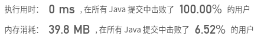

## [112. 路径总和](https://leetcode-cn.com/problems/path-sum/)

## 题目

给定一个二叉树和一个目标和，判断该树中是否存在根节点到叶子节点的路径，这条路径上所有节点值相加等于目标和。

说明: 叶子节点是指没有子节点的节点。

示例: 
给定如下二叉树，以及目标和 sum = 22，

```java
          5
         / \
        4   8
       /   / \
      11  13  4
     /  \      \
    7    2      1
```
返回 true, 因为存在目标和为 22 的根节点到叶子节点的路径 `5->4->11->2`。


链接：https://leetcode-cn.com/problems/path-sum

## 解题记录

+ 通过递归进行判断
+ 如果左右都是null，为叶子节点，判断sum是否已经减少到0
+ 不是叶节点，判断左右节点，又一个为true则为true，将true传递到根节点

```java
/**
 * @author ffzs
 * @describe
 * @date 2020/7/7
 */

class TreeNode {
    int val;
    TreeNode left;
    TreeNode right;
    TreeNode(int x) { val = x; }
}

public class Solution {
    public boolean hasPathSum(TreeNode root, int sum) {
        if (root == null) return false;
        sum -= root.val;
        if (root.right == null && root.left == null) return sum == 0;
        return hasPathSum(root.right, sum) || hasPathSum(root.left, sum);
    }
}
```

