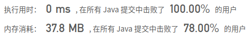
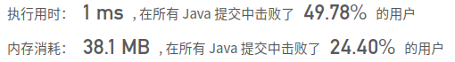

## [94. 二叉树的中序遍历](https://leetcode-cn.com/problems/binary-tree-inorder-traversal/)

## 题目

给定一个二叉树，返回它的中序 遍历。

```java
示例:

输入: [1,null,2,3]
   1
    \
     2
    /
   3

输出: [1,3,2]
```

进阶: 递归算法很简单，你可以通过迭代算法完成吗？


链接：https://leetcode-cn.com/problems/binary-tree-inorder-traversal


## 解题记录

+ 递归方法

```java
/**
 * @author: ffzs
 * @Date: 2020/9/14 上午7:27
 */
class TreeNode {
    int val;
    TreeNode left;
    TreeNode right;
    TreeNode(int x) { val = x; }
}

public class Solution {
    List<Integer> res = new ArrayList<>();
    public List<Integer> inorderTraversal(TreeNode root) {
        dfs(root);
        return res;
    }

    private void dfs (TreeNode root) {
        if (root != null) {
            dfs(root.left);
            res.add(root.val);
            dfs(root.right);
        }
    }
}
```




## 进阶

+ 迭代
+ 递归是机器将方法用栈存放，最后弹出
+ 迭代也可以使用栈，找到分支最左子叶，然后处理，如果有右子叶进入下一个分支

```java
/**
 * @author: ffzs
 * @Date: 2020/9/14 上午7:32
 */
public class Solution2 {

    public List<Integer> inorderTraversal(TreeNode root) {
        List<Integer> res = new ArrayList<>();

        if (root == null) return res;

        Deque<TreeNode> stack = new LinkedList<>();
        while (!stack.isEmpty() || root != null) {
            // 将所有左子叶压入栈中
            while (root!=null) {
                stack.push(root);
                root = root.left;
            }

            TreeNode cur = stack.pop();
            res.add(cur.val);

            if (cur.right != null){
                root = cur.right;
            }
        }
        return res;
    }
}
```

