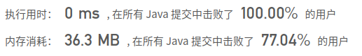

## [226. 翻转二叉树](https://leetcode-cn.com/problems/invert-binary-tree/)

## 题目

翻转一棵二叉树。

```java
示例：

输入：

     4
   /   \
  2     7
 / \   / \
1   3 6   9
```


```java
输出：

     4
   /   \
  7     2
 / \   / \
9   6 3   1
```


```java
备注:
这个问题是受到 Max Howell 的 原问题 启发的 ：

谷歌：我们90％的工程师使用您编写的软件(Homebrew)，但是您却无法在面试时在白板上写出翻转二叉树这道题，这太糟糕了。
```


链接：https://leetcode-cn.com/problems/invert-binary-tree

## 解题记录

+ 创建一个新树，一起前序遍历，如果老树上有左，就在新树上写右

```java
/**
 * @author: ffzs
 * @Date: 2020/9/16 上午7:07
 */

class TreeNode {
    int val;
    TreeNode left;
    TreeNode right;
    TreeNode(int x) { val = x; }
}


public class Solution {

    public TreeNode invertTree(TreeNode root) {
        if (root == null) return null;
        TreeNode res = new TreeNode(root.val);
        dfs(root, res);
        return res;
    }

    private void dfs(TreeNode root, TreeNode res) {
        if (root.left != null) {
            res.right = new TreeNode(root.left.val);
            dfs(root.left, res.right);
        }
        if (root.right != null) {
            res.left = new TreeNode(root.right.val);
            dfs(root.right, res.left);
        }
    }
}
```

