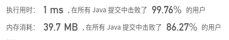

## [110. 平衡二叉树](https://leetcode-cn.com/problems/balanced-binary-tree/)

## 题目

给定一个二叉树，判断它是否是高度平衡的二叉树。

本题中，一棵高度平衡二叉树定义为：

一个二叉树每个节点 的左右两个子树的高度差的绝对值不超过1。

```java
示例 1:

给定二叉树 [3,9,20,null,null,15,7]

    3
   / \
  9  20
    /  \
   15   7
返回 true 。
```

```java
示例 2:

给定二叉树 [1,2,2,3,3,null,null,4,4]

       1
      / \
     2   2
    / \
   3   3
  / \
 4   4
返回 false 。
```

 


链接：https://leetcode-cn.com/problems/balanced-binary-tree

## 解题记录

+ 后续遍历，每层比较左右两边的深度，如果差距大于1的话，标记结果为false
+ 每个节点返回最深子节点用以比较深度


```java
/**
 * @author: ffzs
 * @Date: 2020/8/17 上午8:46
 */


class TreeNode {
    int val;
    TreeNode left;
    TreeNode right;
    TreeNode(int x) { val = x; }
}

public class Solution {

    boolean isBalanced = true;
    public boolean isBalanced(TreeNode root) {
        isBalanced(root, 0);
        return isBalanced;
    }

    private int isBalanced(TreeNode root, int level) {
        if (root == null) return level - 1;

        int left = isBalanced(root.left, level + 1);
        int right = isBalanced(root.right, level + 1);
        if (Math.abs(left-right)>1) isBalanced = false;
        return Math.max(left, right);
    }
}
```

