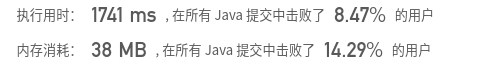
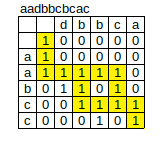
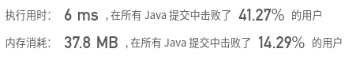
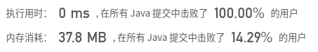

## [97. 交错字符串](https://leetcode-cn.com/problems/interleaving-string/)

## 题目

给定三个字符串 s1, s2, s3, 验证 s3 是否是由 s1 和 s2 交错组成的。

```java
示例 1:

输入: s1 = "aabcc", s2 = "dbbca", s3 = "aadbbcbcac"
输出: true
```

```java
示例 2:

输入: s1 = "aabcc", s2 = "dbbca", s3 = "aadbbbaccc"
输出: false
```


链接：https://leetcode-cn.com/problems/interleaving-string


## 解题记录

+ 将s3的内容跟s1和s2一一比对
+ 如果某一位置上s1和s2相同，那么会出现两个分支
+ 两个分支分别判断即可

```java
/**
 * @author: ffzs
 * @Date: 2020/7/18 上午7:45
 */
public class Solution {
    static int l1, l2, l3;
    static char[] c1, c2, c3;
    public static boolean isInterleave(String s1, String s2, String s3) {
        l1 = s1.length();
        l2 = s2.length();
        l3 = s3.length();
        c1 = s1.toCharArray();
        c2 = s2.toCharArray();
        c3 = s3.toCharArray();
        if (l1 + l2 != l3) return false;
        return isMatch(0,0,0);
    }

    private static boolean isMatch (int i, int j, int k) {
        boolean f1, f2;

        while (k < l3) {
            if (i < l1 && c1[i] == c3[k]) {
                if (j < l2 && c2[j] == c3[k]) {
                    f1 = isMatch(i+1, j, k+1);
                    f2 = isMatch(i, j+1, k+1);
                    return f1||f2;
                }
                else i++;
            }
            else if (j < l2 && c2[j] == c3[k]) j++;
            else return false;
            k++;
        }
        return true;
    }

    public static void main(String[] args) {
        String s1 = "aabcc";
        String s2 = "dbbca";
        String s3 = "aadbbcbcac";
        System.out.println(isInterleave(s1, s2, s3));
    }
}

```



不过效率有点低

## 进阶 动态规划



+ 通过动态规划进行

```java
/**
 * @author: ffzs
 * @Date: 2020/7/18 上午8:45
 */
public class Solution2 {
    public static boolean isInterleave(String s1, String s2, String s3) {
        int l1 = s1.length(), l2 = s2.length(), l3 = s3.length();

        if (l1 + l2 != l3) return false;

        boolean[][] dp = new boolean[l1+1][l2+1];
        dp[0][0] = true;
        for (int i = 0; i < l1+1; ++i) {
            for (int j = 0; j < l2+1; ++j) {
                int k = i + j - 1;
                if (i == 0 && j == 0) continue;
                else if (i > 0 && j == 0) dp[i][j] = dp[i-1][j] && s1.charAt(i-1) == s3.charAt(k);
                else if (i == 0)  dp[i][j] = dp[i][j-1] && s2.charAt(j-1) == s3.charAt(k);
                else dp[i][j] = (dp[i-1][j] && s1.charAt(i-1) == s3.charAt(k)) || (dp[i][j-1] && s2.charAt(j-1) == s3.charAt(k));
            }
        }
        return dp[l1][l2];
    }

    public static void main(String[] args) {
        String s1 = "aabcc";
        String s2 = "dbbca";
        String s3 = "aadbbcbcac";
        System.out.println(isInterleave(s1, s2, s3));
    }
}

```



## 进阶  记忆递归

+ 整合上面两种方法，通过dp记录行不通的路径

```java
/**
 * @author: ffzs
 * @Date: 2020/7/18 上午9:42
 */
public class Solution3 {
    static boolean[][] dp;
    static int l1, l2, l3;
    static char[] c1, c2, c3;
    public static boolean isInterleave(String s1, String s2, String s3) {
        l1 = s1.length();
        l2 = s2.length();
        l3 = s3.length();
        if (l1 + l2 != l3) return false;
        c1 = s1.toCharArray();
        c2 = s2.toCharArray();
        c3 = s3.toCharArray();
        dp = new boolean[l1+1][l2+1];
        return isMatch(0,0,0);
    }

    private static boolean isMatch (int i, int j, int k) {
        if (dp[i][j] || i > l1 || j > l2 ) return false;
        if (l1 == i && l2 == j) return true;
        if (i<l1 && c1[i] == c3[k] && isMatch(i+1,j,k+1)) return true;
        if (j<l2 && c2[j] == c3[k] && isMatch(i,j+1,k+1)) return true;
        dp[i][j] = true;
        return false;
    }

    public static void main(String[] args) {
        String s1 = "aabcc";
        String s2 = "dbbca";
        String s3 = "aadbbcbcac";
        System.out.println(isInterleave(s1, s2, s3));
    }

}
```

