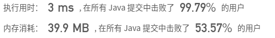

## [44. 通配符匹配](https://leetcode-cn.com/problems/wildcard-matching/)

## 题目

给定一个字符串 (s) 和一个字符模式 (p) ，实现一个支持 '?' 和 '*' 的通配符匹配。

'?' 可以匹配任何单个字符。
'*' 可以匹配任意字符串（包括空字符串）。
两个字符串完全匹配才算匹配成功。

```java
说明:

s 可能为空，且只包含从 a-z 的小写字母。
p 可能为空，且只包含从 a-z 的小写字母，以及字符 ? 和 *。
```

```java
示例 1:

输入:
s = "aa"
p = "a"
输出: false
解释: "a" 无法匹配 "aa" 整个字符串。
```

```java
示例 2:

输入:
s = "aa"
p = "*"
输出: true
解释: '*' 可以匹配任意字符串。
```

```java
示例 3:

输入:
s = "cb"
p = "?a"
输出: false
解释: '?' 可以匹配 'c', 但第二个 'a' 无法匹配 'b'。
```

```java
示例 4:

输入:
s = "adceb"
p = "*a*b"
输出: true
解释: 第一个 '*' 可以匹配空字符串, 第二个 '*' 可以匹配字符串 "dce".
```

```java
示例 5:

输入:
s = "acdcb"
p = "a*c?b"
输出: false
```


链接：https://leetcode-cn.com/problems/wildcard-matching

## 解题记录

+ 通过动态规划求解
+ 跟 [Leetcode:NO.10 正则表达式匹配 动态规划](https://blog.csdn.net/tonydz0523/article/details/106876579)比较像，但是比这个简单
+ 出现*，三种情况，空，匹配一个，匹配多个
+ 出现相等或是`？`的情况状态方程为`dp[i][j] = dp[i-1][j-1]`

```java
/**
 * @author ffzs
 * @describe
 * @date 2020/7/5
 */
public class Solution {
    public static boolean isMatch(String s, String p) {
        char[] sChar = s.toCharArray();
        char[] pChar = p.toCharArray();

        boolean[][] dp = new boolean[sChar.length+1][pChar.length+1];
        dp[0][0] = true;
        for (int i = 0; i <= sChar.length; ++i) {
            for (int j = 1; j <= pChar.length; ++j) {
                if (i == 0) {
                    if (pChar[j-1] == '*') dp[i][j] = dp[i][j-1];
                }
                else {
                    if (pChar[j-1] == '*') {
                        if (dp[i - 1][j - 1] || dp[i-1][j] || dp[i][j-1]) dp[i][j] = true;
                    }
                    else {
                        if (pChar[j-1] == '?' || pChar[j-1] == sChar[i-1]) dp[i][j] = dp[i-1][j-1];
                    }
                }
            }
        }
        return dp[sChar.length][pChar.length];
    }

    public static void main(String[] args) {
        String s = "cab";
        String p = "*";
        System.out.println(isMatch(s, p));
    }
}

```


+ 本题还可以使用溯源算法
+ 记录出现`*`位置，如果之后没有配置上，那么回溯`*`位置并使`*`多匹配一位

```java
/**
 * @author ffzs
 * @describe
 * @date 2020/7/5
 */
public class Solution2 {
    public static boolean isMatch(String s, String p) {
        int si = 0, pi = 0, ss = -1, sp = -1;
        while (si < s.length()) {
            if (pi < p.length() && (s.charAt(si) == p.charAt(pi) || p.charAt(pi) == '?')) {
                si ++; pi++;
            }
            else if (pi < p.length() && p.charAt(pi) == '*') {
                ss = si; sp = pi++;
            }
            else if (ss != -1) {
                si = ++ss; pi = sp;
            }
            else return false;
        }
        while (pi < p.length() && p.charAt(pi) == '*') pi++;
        return pi == p.length();
    }

    public static void main(String[] args) {
        String s = "aa";
        String p = "*";
        System.out.println(isMatch(s, p));
    }
}
```

