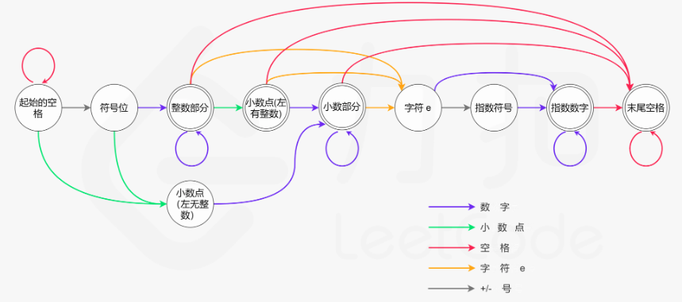

## [剑指 Offer 20. 表示数值的字符串](https://leetcode-cn.com/problems/biao-shi-shu-zhi-de-zi-fu-chuan-lcof/)

## 题目

请实现一个函数用来判断字符串是否表示数值（包括整数和小数）。例如，字符串"+100"、"5e2"、"-123"、"3.1416"、"-1E-16"、"0123"都表示数值，但"12e"、"1a3.14"、"1.2.3"、"+-5"及"12e+5.4"都不是。


链接：https://leetcode-cn.com/problems/biao-shi-shu-zhi-de-zi-fu-chuan-lcof

## 解题记录

写一下规律：

+ 第一个字符可以是`+`，`-`,数字
+ `e`或`E`前必有数字，`e`后只能是整数
+ `e`只能出现一次
+ 前后有空格无所谓

```java
/**
 * @author: ffzs
 * @Date: 2020/9/2 上午7:45
 */

public class Solution {
    boolean haveE =  false;
    boolean isFloat = false;
    boolean haveSymbol = false;
    boolean haveNumber = false;
    public boolean isNumber(String s) {
        char[] seq = s.toCharArray();
        int i = 0;

        while (i < seq.length) {
            System.out.println(seq[i]);
            switch (seq[i]) {
                // 空值在前面的话直接跳过， 在后面的话循环之后
                case ' ':
                    if (i==0) {
                        if (haveE) return false;
                        while (i<seq.length && seq[i]==' ') i++;
                        break;
                    }
                    else {
                        while (i<seq.length && seq[i]==' ') i++;
                        if (i!=seq.length) return false;
                        break;
                    }
                    // 之前不能有数组和小数点
                case '-':
                case '+':
                    if (haveNumber||isFloat) return false;
                    haveSymbol = true;
                    i++; break;
                    // e之后的不能出现小数，已经有小数点的不能再出现小数点
                case '.':
                    if (haveE||isFloat) return false;
                    isFloat = true;
                    i++; break;
                    // 之前没有数字不行 刷新之前number和小数
                case 'e':
                case 'E':
                    if(haveE||!haveNumber) return false;
                    haveNumber=false;
                    isFloat=false;
                    haveE=true;
                    return isNumber(s.substring(i+1));
                default:
                    // 剩下的如果不是数字不行
                    if(isNum(seq[i])){
                        haveNumber = true;
                        i++; break;
                    }
                    else return false;
            }
        }
        // 整个字符必须有数字才能算数
        return haveNumber;
    }

    private boolean isNum (char c) {
        return c>='0' && c<='9';
    }
}

class Test {
    public static void main(String[] args) {
        String num = "32.e-80123";
        Solution solution = new Solution();
        System.out.println(solution.isNumber(num));
    }
}
```


其实可以先trim之后再根据e将字符分为两部分，分别判断，e后部分不可以有小数，只不过这样遍历了三遍字符串，但是速度没准更快，因为少了很多判断。

## 进阶

看了一下题解，基本都是使用有限状态自动机，借用一下官方的图：



通过不同情况构建处状态类型：

+ 起始的空格
+ 符号位
+ 整数部分
+ 左侧有整数的小数点
+ 左侧无整数的小数点（根据前面的第二条额外规则，需要对左侧有无整数的两种小数点做区分）
+ 小数部分
+ 字符 e
+ 指数部分的符号位
+ 指数部分的整数部分
+ 末尾的空格

这样做虽然看似麻烦，但是如果状态多了之后管理梳理起来更容易一些：

```java
/**
 * @author: ffzs
 * @Date: 2020/9/2 上午9:23
 * <p>
 * 字符类型：
 * 0~9  ->NUM -> n
 * +，-  ->SIGN ->s
 * .    -> DOT ->d
 * e,E  ->EXP ->e
 * ' '  ->BLANK ->b
 * <p>
 * 状态：
 * 0：起始的空格
 * 1：符号位
 * 2：整数部分
 * 3：左侧有整数的小数点
 * 4：左侧无整数的小数点（根据前面的第二条额外规则，需要对左侧有无整数的两种小数点做区分）
 * 5：小数部分
 * 6：字符 e
 * 7：指数部分的符号位
 * 8：指数部分的整数部分
 * 9：末尾的空格
 */

public class Solution2 {
    public boolean isNumber(String s) {
        Map[] states = {
                //0：起始的空格
                new HashMap<>() {{
                    put('b', 0);
                    put('d', 4);
                    put('s', 1);
                    put('n', 2);
                }},
                //1：符号位
                new HashMap<>() {{
                    put('d', 4);
                    put('n', 2);
                }},
                //2：整数部分
                new HashMap<>() {{
                    put('n', 2);
                    put('e', 6);
                    put('b', 9);
                    put('d', 3);
                }},
                //3：左侧有整数的小数点
                new HashMap<>() {{
                    put('n', 5);
                    put('b', 9);
                    put('e', 6);
                }},
                //4：左侧无整数的小数点（根据前面的第二条额外规则，需要对左侧有无整数的两种小数点做区分）
                new HashMap<>() {{
                    put('n', 5);
                }},
                //5：小数部分
                new HashMap<>() {{
                    put('n', 5);
                    put('b', 9);
                    put('e', 6);
                }},
                //6：字符 e
                new HashMap<>() {{
                    put('s', 7);
                    put('n', 8);
                }},
                //7：指数部分的符号位
                new HashMap<>() {{
                    put('n', 8);
                }},
                //8：指数部分的整数部分
                new HashMap<>() {{
                    put('n', 8);
                    put('b', 9);
                }},
                //9：末尾的空格
                new HashMap<>() {{
                    put('b', 9);
                }},
        };

        int i = 0;
        char type;
        for (char c : s.toCharArray()) {
            switch (c) {
                case '+':
                case '-':
                    type = 's';
                    break;
                case 'e':
                case 'E':
                    type = 'e';
                    break;
                case '.':
                    type = 'd';
                    break;
                case ' ':
                    type = 'b';
                    break;
                default:
                    if (c >= '0' && c <= '9') type = 'n';
                    else return false;
            }
            if (!states[i].containsKey(type)) return false;
            i = (int) states[i].get(type);
        }
        return i == 2 || i == 3 || i == 5 || i == 8 || i == 9;
    }
}
```

