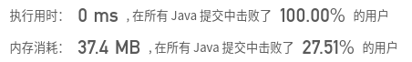

## [100. 相同的树](https://leetcode-cn.com/problems/same-tree/)

## 题目

给定两个二叉树，编写一个函数来检验它们是否相同。

如果两个树在结构上相同，并且节点具有相同的值，则认为它们是相同的。

```jaava
示例 1:

输入:       1         1
              / \       / \
             2   3     2   3

[1,2,3],   [1,2,3]

输出: true
```


```java
示例 2:

输入:
			1        1
          /           \
         2             2

[1,2],     [1,null,2]

输出: false
```


```java
示例 3:

输入:  
           1         1
          / \       / \
         2   1     1   2

        [1,2,1],   [1,1,2]

输出: false
```


链接：https://leetcode-cn.com/problems/same-tree

## 解题记录

+ 直接同时遍历树，遍历的过程中进行比对即可
+ 无所谓，前序，中序，后续
+ 无所谓递归还是递推

```java
/**
 * @author: ffzs
 * @Date: 2020/8/7 上午7:26
 */


class TreeNode {
    int val;
    TreeNode left;
    TreeNode right;
    TreeNode() {}
    TreeNode(int val) { this.val = val; }
    TreeNode(int val, TreeNode left, TreeNode right) {
        this.val = val;
        this.left = left;
        this.right = right;
    }
}

public class Solution {
    public boolean isSameTree(TreeNode p, TreeNode q) {

        if(p == null && q == null) return true;
        else if (p == null || q == null) return false;

        return isSameTree(p.left, q.left) && isSameTree(p.right, q.right) && p.val == q.val;
    }
}
```



