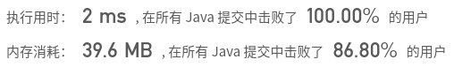

## [657. 机器人能否返回原点](https://leetcode-cn.com/problems/robot-return-to-origin/)

## 题目

在二维平面上，有一个机器人从原点 (0, 0) 开始。给出它的移动顺序，判断这个机器人在完成移动后是否在 (0, 0) 处结束。

移动顺序由字符串表示。字符 move[i] 表示其第 i 次移动。机器人的有效动作有 R（右），L（左），U（上）和 D（下）。如果机器人在完成所有动作后返回原点，则返回 true。否则，返回 false。

注意：机器人“面朝”的方向无关紧要。 “R” 将始终使机器人向右移动一次，“L” 将始终向左移动等。此外，假设每次移动机器人的移动幅度相同。

 

```java
示例 1:

输入: "UD"
输出: true
解释：机器人向上移动一次，然后向下移动一次。所有动作都具有相同的幅度，因此它最终回到它开始的原点。因此，我们返回 true。
```

```java
示例 2:

输入: "LL"
输出: false
解释：机器人向左移动两次。它最终位于原点的左侧，距原点有两次 “移动” 的距离。我们返回 false，因为它在移动结束时没有返回原点。
```


链接：https://leetcode-cn.com/problems/robot-return-to-origin

## 解题记录

+ 根据题目可知，想要回到原点，向上和向下走的步数必须相同，向左和向右的步数也必须相同
+ 如果出现奇数步数铁定回不去的

```java
/**
 * @author: ffzs
 * @Date: 2020/8/28 上午7:25
 */

public class Solution {

    public boolean judgeCircle(String moves) {
        char[] seq = moves.toCharArray();
        if ((seq.length & 1) == 1) return false;
        int[] count = new int[26];
        for (char c : seq) {
            count[c-'A']++;
        }
        return count['R'-'A'] == count['L'-'A'] && count['U'-'A'] == count['D'-'A'];
    }
}
```

