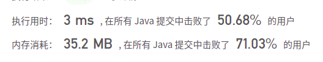
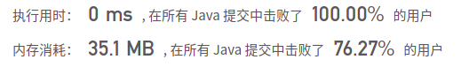

## 633. 平方数之和

## 题目

给定一个非负整数 c ，你要判断是否存在两个整数 a 和 b，使得 a2 + b2 = c 。

```java
示例 1：
输入：c = 5
输出：true
解释：1 * 1 + 2 * 2 = 5
    
示例 2：
输入：c = 3
输出：false
    
示例 3：
输入：c = 4
输出：true
    
示例 4：
输入：c = 2
输出：true
    
示例 5：
输入：c = 1
输出：true
```


```java
提示：
0 <= c <= 231 - 1
```

链接：https://leetcode-cn.com/problems/sum-of-square-numbers

## 解题记录

+ 通过双指针解题
+ 左指针从0开始，右指针从c开方开始，左右指针的平方相加如果小于c那么左指针向右移一位
+ 如果大于c的话右指针向左移一位
+ 相等的话返回true

```java
/**
 * @author: ffzs
 * @Date: 2021/4/28 上午9:35
 */
public class Solution {

    public boolean judgeSquareSum(int c) {
        int l = 0, r = (int) Math.sqrt(c);

        while (l < r) {
            int v = l * l + r * r;
            if (v == c) return true;
            else if (v < c) l++;
            else r--;
        }

        return false;
    }
}
```



+ 数学法


```java
/**
 * @author: ffzs
 * @Date: 2021/4/28 上午9:57
 */
public class Solution2 {

    public boolean judgeSquareSum(int c) {
        for (int i = 2; i*i <= c; i++) {
            if (c % i != 0) continue;
            int cnt = 0;
            while (c % i == 0) {
                c /= i;
                cnt ++;
            }
            if (i % 4 == 3 && cnt % 2 == 1) return false;
        }

        return c % 4 != 3;
    }

}
```

