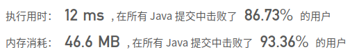

## [973. 最接近原点的 K 个点](https://leetcode-cn.com/problems/k-closest-points-to-origin/)

## 题目

我们有一个由平面上的点组成的列表 points。需要从中找出 K 个距离原点 (0, 0) 最近的点。

（这里，平面上两点之间的距离是欧几里德距离。）

你可以按任何顺序返回答案。除了点坐标的顺序之外，答案确保是唯一的。

 

```java
示例 1：

输入：points = [[1,3],[-2,2]], K = 1
输出：[[-2,2]]
解释： 
(1, 3) 和原点之间的距离为 sqrt(10)，
(-2, 2) 和原点之间的距离为 sqrt(8)，
由于 sqrt(8) < sqrt(10)，(-2, 2) 离原点更近。
我们只需要距离原点最近的 K = 1 个点，所以答案就是 [[-2,2]]。
示例 2：

输入：points = [[3,3],[5,-1],[-2,4]], K = 2
输出：[[3,3],[-2,4]]
（答案 [[-2,4],[3,3]] 也会被接受。）
```


提示：

1 <= K <= points.length <= 10000
-10000 < points[i][0] < 10000
-10000 < points[i][1] < 10000


链接：https://leetcode-cn.com/problems/k-closest-points-to-origin

## 解题记录

+ 通过一个map存储平方和的数据和index
+ 之后再通过排序之后的顺序获取index获取原值

```java
/**
 * @author: ffzs
 * @Date: 2020/11/9 上午7:15
 */
public class Solution {

    public int[][] kClosest(int[][] points, int K) {
        int[][] res = new int[K][2];
        long[] tmp = new long[points.length];
        Map<Long, List<Integer>> map = new HashMap<>();
        for (int i = 0; i < tmp.length; i++) {
            long it = points[i][0] * points[i][0] + points[i][1] * points[i][1];
            tmp[i] = it;
            if (!map.containsKey(it)) map.put(it, new ArrayList<>());
            map.get(it).add(i);
        }
        Arrays.sort(tmp);
        int i = 0;
        while (i < K) {
            List<Integer> lst = map.get(tmp[i]);
            for (Integer it : lst) {
                res[i++] = points[it];
            }
        }
        return res;
    }
}
```


+ 获取数据之后排序获取到第K小的平方和值再次遍历数组通过比对平方和获取到小于K个

```java
/**
 * @author: ffzs
 * @Date: 2020/11/9 上午7:45
 */
public class Solution2 {

    public int[][] kClosest(int[][] points, int K) {

        int[] tmp = new int[points.length];
        int[][] res = new int[K][2];
        for (int i = 0; i < tmp.length; i++) {
            tmp[i] = dist(points[i]);
        }
        Arrays.sort(tmp);
        int i = 0;
        for (int[] point : points) {
            if (dist(point) <= tmp[K-1]) {
                res[i++] = point;
            }
            if (i == K) break;
        }
        return res;
    }

    private int dist(int[] p) {
        return p[0] * p[0] + p[1] * p[1];
    }

}
```



## 进阶

+ 通过数组的平方和的大小进行快速排序
+ 因为只要前K个最小值，因此只要前K个是排序好了的就可以

```java
/**
 * @author: ffzs
 * @Date: 2020/11/9 上午8:01
 */
public class Solution3 {

    public int[][] kClosest(int[][] points, int K) {

        int left = 0, right = points.length-1, cur = -1;
        while (cur != K - 1) {
            cur = quickSort(points, left, right);
            if (cur < K - 1) left = cur + 1;
            if (cur > K - 1) right = cur - 1;
        }
        return Arrays.copyOf(points, K);
    }

    private int quickSort(int[][] p, int l, int r) {
        int dis = dist(p[l]);
        while (l < r) {
            while (l < r && dist(p[r]) >= dis) r--;
            if (l < r) swap(p, l, r);
            while (l < r && dist(p[l]) <= dis) l++;
            if (l<r) swap(p, l ,r);
        }
        swap(p ,l, r);
        return l;
    }

    private int dist(int[] p) {
        return p[0]*p[0] + p[1]*p[1];
    }

    private void swap(int[][] p, int l, int r) {
        int[] tmp = p[l];
        p[l] = p[r];
        p[r] = tmp;
    }
}
```

