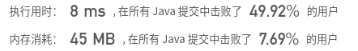
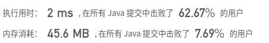
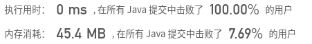

## [378. 有序矩阵中第K小的元素](https://leetcode-cn.com/problems/kth-smallest-element-in-a-sorted-matrix/)

## 题目

给定一个 n x n 矩阵，其中每行和每列元素均按升序排序，找到矩阵中第 k 小的元素。
请注意，它是排序后的第 k 小元素，而不是第 k 个不同的元素。

 

```java
示例：

matrix = [
   [ 1,  5,  9],
   [10, 11, 13],
   [12, 13, 15]
],
k = 8,

返回 13。
```

```java
提示：
你可以假设 k 的值永远是有效的，1 ≤ k ≤ n2 。
```


链接：https://leetcode-cn.com/problems/kth-smallest-element-in-a-sorted-matrix

## 解题记录

+ 通过数组的sort方法进行处理
+ 通过将二维矩阵变成一维数组
+ 然后排序后获取第k-1位即为所求

```java
/**
 * @author ffzs
 * @describe
 * @date 2020/7/2
 */
public class Solution {
    public int kthSmallest(int[][] matrix, int k) {
        int[] res = new int[matrix.length * matrix.length];
        for (int i = 0; i < matrix.length; i++) {
            for (int j = 0; j < matrix.length; j++) {
                res[i*matrix.length + j] = matrix[j][i];
            }
        }
        Arrays.sort(res);
        return res[k-1];
    }
}
```



+ 转换为一维数组后，通过自己编写的快速排序获取答案
+ 类似[Leetcode:NO.215 数组中的第K个最大元素 二分法](https://blog.csdn.net/tonydz0523/article/details/107018185)

```java
/**
 * @author ffzs
 * @describe
 * @date 2020/7/2
 */
public class Solution2 {
    public static int kthSmallest(int[][] matrix, int k) {
        int[] res = new int[matrix.length * matrix.length];
        for (int i = 0; i < matrix.length; i++) {
            for (int j = 0; j < matrix.length; j++) {
                res[i*matrix.length + j] = matrix[j][i];
            }
        }
        return quickSort(res, 0, res.length-1, res.length+1-k);
    }

    private static int quickSort(int[] lst, int l, int r, int k){
        if (l == r) return lst[l];
        int mid = lst[l+r >> 1];
        int left = l, right = r;
        while (true) {
            while (lst[left] < mid) left ++;
            while (lst[right] > mid) right --;
            if (left < right) swap(lst, left++, right--);
            else break;
        }
        if (r-right >= k) return quickSort(lst, right+1, r, k);
        else return quickSort(lst, l, right, k-(r-right));
    }

    private static void swap (int[] lst, int i, int j) {
        int tmp = lst[i];
        lst[i] = lst[j];
        lst[j] = tmp;
    }

    public static void main(String[] args) {
//        int[][] matrix = {{1,5,9}, {10,11,13}, {12,13,15}};
        int[][] matrix = {{1,2}, {1,3}};
        System.out.println(kthSmallest(matrix, 4));
    }
}
```


+ 本题用上面的方法求其实是有浪费步骤，因为本题的数组是部分有序的，就是说我们想要求第K小数并不需要排序过程，只要通过二分法进行切割即可

```java
/**
 * @author ffzs
 * @describe
 * @date 2020/7/2
 */
public class Solution3 {
    public int kthSmallest(int[][] matrix, int k) {
        int n = matrix.length;
        int left = matrix[0][0], right = matrix[n-1][n-1];
        while (left < right) {
            int mid = left+right >> 1;
            if (countLeft(matrix, mid) < k) left = mid +1;
            else right = mid;
        }
        return left;
    }

    private int countLeft (int[][] matrix, int mid) {
        int count = 0;
        for (int[] ints : matrix) {
            int j = 0;
            while (ints[j] <= mid) j++;
            count += j;
        }
        return count;
    }
}
```



+ 由于每列数据也是递增的，那么统计mid左边个数的时候，可以继承之前的列数，因为下层该列的数一定不大于上层

```java
    private int countLeft(int[][] matrix, int mid) {
        int count = 0;
        int j = 0;
        for (int i = matrix.length - 1; i >= 0; --i) {
            while (j < matrix.length && matrix[i][j] <= mid) j++;
            count += j;
        }
        return count;
    }
```

