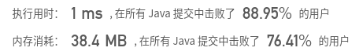
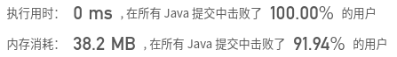

## [17. 电话号码的字母组合](https://leetcode-cn.com/problems/letter-combinations-of-a-phone-number/)

## 题目

给定一个仅包含数字 2-9 的字符串，返回所有它能表示的字母组合。

给出数字到字母的映射如下（与电话按键相同）。注意 1 不对应任何字母。


```java
示例:

输入："23"
输出：["ad", "ae", "af", "bd", "be", "bf", "cd", "ce", "cf"].
```

```java
说明:
尽管上面的答案是按字典序排列的，但是你可以任意选择答案输出的顺序。
```


链接：https://leetcode-cn.com/problems/letter-combinations-of-a-phone-number

## 解题记录

+ 通过回溯算法求解
+ 首先构造letter的映射
+ 每一轮都分别添加字符，通过添加之后删掉的方式

```java
/**
 * @author: ffzs
 * @Date: 2020/8/26 上午7:20
 */

public class Solution {
    private final Map<Character, String> letterMap = new HashMap<>(){{
        put('2', "abc");
        put('3', "def");
        put('4', "ghi");
        put('5', "jkl");
        put('6', "mno");
        put('7', "pqrs");
        put('8', "tuv");
        put('9', "wxyz");
    }};
    private char[] seq;
    private List<String> res = new ArrayList<>();;
    public List<String> letterCombinations(String digits) {
        this.seq = digits.toCharArray();
        if (seq.length==0) return new ArrayList<>();
        dfs(0, new StringBuilder());
        return res;
    }

    private void dfs (int index, StringBuilder s) {
        if (index == seq.length) {
            res.add(String.valueOf(s));
        }
        else {
            char[] letters = letterMap.get(seq[index]).toCharArray();
            for (char letter : letters) {
                s.append(letter);
                dfs(index+1, s);
                s.deleteCharAt(index);
            }
        }
    }
}

class Test {
    public static void main(String[] args) {
        Solution solution = new Solution();
        String digits = "23";
        System.out.println(solution.letterCombinations(digits));
    }
}
```



+ 优化letterMap

```java
/**
 * @author: ffzs
 * @Date: 2020/8/26 上午7:58
 */
public class Solution2 {
    private final String[] letterMap = {"", "", "abc", "def", "ghi", "jkl", "mno", "pqrs", "tuv", "wxyz"};
    private char[] seq;
    private List<String> res = new ArrayList<>();;
    public List<String> letterCombinations(String digits) {
        this.seq = digits.toCharArray();
        if (seq.length==0) return new ArrayList<>();
        dfs(0, new StringBuilder());
        return res;
    }

    private void dfs (int index, StringBuilder s) {
        if (index == seq.length) {
            res.add(String.valueOf(s));
        }
        else {
            char[] letters = letterMap[seq[index]-'0'].toCharArray();
            for (char letter : letters) {
                s.append(letter);
                dfs(index+1, s);
                s.deleteCharAt(index);
            }
        }
    }
}
```

