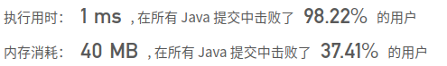

## [107. 二叉树的层次遍历 II](https://leetcode-cn.com/problems/binary-tree-level-order-traversal-ii/)

## 题目

给定一个二叉树，返回其节点值自底向上的层次遍历。 （即按从叶子节点所在层到根节点所在的层，逐层从左向右遍历）

```java
例如：
给定二叉树 [3,9,20,null,null,15,7],

    3
   / \
  9  20
    /  \
   15   7
返回其自底向上的层次遍历为：

[
  [15,7],
  [9,20],
  [3]
]
```


链接：https://leetcode-cn.com/problems/binary-tree-level-order-traversal-ii

## 解题记录

+ 简单的层序遍历即可
+ 每层确定size进行循环确保本层所有的node都被取出，添加下一层的node进行处理

```java
/**
 * @author: ffzs
 * @Date: 2020/9/6 上午7:00
 */

class TreeNode {
    int val;
    TreeNode left;
    TreeNode right;
    TreeNode(int x) { val = x; }
}


public class Solution {
    public List<List<Integer>> levelOrderBottom(TreeNode root) {
        List<List<Integer>> res = new LinkedList<>();
        if (root==null) return res;
        Deque<TreeNode> queue = new LinkedList<>();
        queue.offer(root);
        while (!queue.isEmpty()) {
            int size = queue.size();
            List<Integer> level = new ArrayList<>();
            for (int i = 0; i < size; i++) {
                TreeNode current = queue.poll();
                level.add(current.val);
                if (current.left!=null) queue.offer(current.left);
                if (current.right!=null) queue.offer(current.right);
            }
            res.add(0,level);
        }
        return res;
    }
}
```

