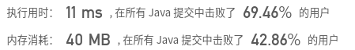
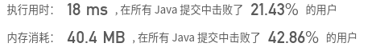

## [329. 矩阵中的最长递增路径](https://leetcode-cn.com/problems/longest-increasing-path-in-a-matrix/)

## 题目

给定一个整数矩阵，找出最长递增路径的长度。

对于每个单元格，你可以往上，下，左，右四个方向移动。 你不能在对角线方向上移动或移动到边界外（即不允许环绕）。

```java
示例 1:

输入: nums = 
[
  [9,9,4],
  [6,6,8],
  [2,1,1]
] 
输出: 4 
解释: 最长递增路径为 [1, 2, 6, 9]。
```

```java
示例 2:

输入: nums = 
[
  [3,4,5],
  [3,2,6],
  [2,2,1]
] 
输出: 4 
解释: 最长递增路径是 [3, 4, 5, 6]。注意不允许在对角线方向上移动。
```


链接：https://leetcode-cn.com/problems/longest-increasing-path-in-a-matrix

## 解题记录

+ 通过使用回溯+有记忆的深度优先算法
+ 通过step数组记录以矩阵的某一个位置起能够获得最大情况

```java
/**
 * @author: ffzs
 * @Date: 2020/7/26 上午7:46
 */
class Solution {
    int n, m;
    int[][] mtx, step;
    final int[][] directions = {{-1, 0}, {1, 0}, {0, -1}, {0, 1}};
    public int longestIncreasingPath(int[][] matrix) {
        if (matrix.length == 0) return 0;
        n = matrix.length;
        m = matrix[0].length;
        mtx = matrix;
        step = new int[n][m];

        int max = 0;
        for (int i = 0; i < n; ++i) {
            for (int j = 0; j < m; ++j) {
                max = Math.max(max, dfs(i, j));
            }
        }

        return max;
    }

    private int dfs (int i, int j) {
        if (step[i][j] != 0) return step[i][j];

        step[i][j] = 1;
        for (int[] direction : directions) {
            int ii = direction[0] + i;
            int jj = direction[1] + j;
            if(ii < n && ii >= 0 && jj < m && jj >=0 && mtx[ii][jj] > mtx[i][j]) {
                step[i][j] = Math.max(step[i][j], dfs(ii, jj) + 1);
            }
        }
        return step[i][j];
    }
}

class TestStep {
    public static void main(String[] args) {
        Solution solution = new Solution();
        int[][] matrix = {{9,9,4}, {6,6,8}, {2,1,1}};
        System.out.println(solution.longestIncreasingPath(matrix));
    }
}

```



## 拓扑排序

+ 通过有向图来确定关系
+ 位点指向大于改为点的邻接位点，记录入度情况
+ 如果入度为0,说明该位点为周围没有大于这个位点的，因此该点为终点
+ 我们通过控制更新入度情况得到最高有几层

```java
/**
 * @author: ffzs
 * @Date: 2020/7/26 上午8:52
 */
public class Solution2 {

    public int longestIncreasingPath(int[][] matrix) {
        if (matrix.length == 0) return 0;
        int[][] directions = {{-1, 0}, {1, 0}, {0, -1}, {0, 1}};
        int n = matrix.length;
        int m = matrix[0].length;
        int[][] inDegree = new int[n][m];
        Queue<int[]> queue = new LinkedList<>();

        for (int i = 0; i < n; ++i) {
            for (int j = 0; j < m; ++j) {
                int count = 0;
                for (int[] direction : directions) {
                    int ii = i + direction[0], jj = j + direction[1];
                    if (ii>=0 && ii<n && jj>=0 && jj<m && matrix[ii][jj]>matrix[i][j]) count ++;
                }
                if (count == 0) queue.add(new int[]{i, j});
                inDegree[i][j] = count;
            }
        }

        int res = 0;
        while(!queue.isEmpty()) {
            res++;
            int size = queue.size();
            for (int i = 0; i < size; i++) {
                int[] item = queue.poll();
                for (int[] direction : directions) {
                    int ii = item[0] + direction[0], jj = item[1] + direction[1];
                    if (ii >= 0 && ii < n && jj >= 0 && jj < m && matrix[ii][jj] < matrix[item[0]][item[1]]){
                        --inDegree[ii][jj];
                        if (inDegree[ii][jj] == 0) queue.add(new int[]{ii, jj});
                    }
                }
            }
        }
        return res;
    }
}

class Test2 {
    public static void main(String[] args) {
        Solution2 solution2 = new Solution2();
        int[][] matrix = {{9,9,4}, {6,6,8}, {2,1,1}};
        System.out.println(solution2.longestIncreasingPath(matrix));
    }
}

```

