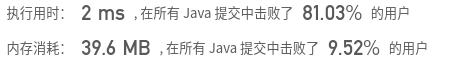
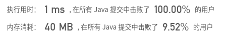

## [32. 最长有效括号](https://leetcode-cn.com/problems/longest-valid-parentheses/)

## 题目

给定一个只包含 '(' 和 ')' 的字符串，找出最长的包含有效括号的子串的长度。

```java
示例 1:

输入: "(()"
输出: 2
解释: 最长有效括号子串为 "()"
```

```java
示例 2:

输入: ")()())"
输出: 4
解释: 最长有效括号子串为 "()()"
```


链接：https://leetcode-cn.com/problems/longest-valid-parentheses


## 解题记录

+ 由于括号的特性，如果为有效括号，那么在统计过程中不会出现`)`的个数大于`（`的情况
+ 由于会有左一直多于右的情况出现，这样不会出现left==right，需要从右向左再统计一次

```java
/**
 * @author ffzs
 * @describe
 * @date 2020/7/4
 */
public class Solution2 {
    public static int longestValidParentheses(String s) {
        char[] seq = s.toCharArray();
        int left = 0, right = 0;
        int res = 0;
        for (char c : seq) {
            if (c == '(') left ++;
            else right ++;
            if (left == right) res = Math.max(res, left*2);
            else if (left < right) left = right = 0;
        }

        left = right = 0;
        for (int i = seq.length-1; i >= 0; --i) {
            if (seq[i] == '(') left ++;
            else right ++;
            if (left == right) res = Math.max(res, left*2);
            else if (right < left) left = right = 0;
        }

        return res;
    }

    public static void main(String[] args) {
        String s = "(())()(()((";
        System.out.println(longestValidParentheses(s));
    }
}
```


+ 动态规划
+ 如果`)`的前一个是`（`那么直接加上`dp[i+1] = dp[i-1] + 2;`
+ 如果不是`（`那要判断是不是`（（））`的情况，如果是的话`dp[i+1] = dp[i] + 2 + dp[i- dp[i] -1];`

```java
/**
 * @author ffzs
 * @describe
 * @date 2020/7/4
 */
public class Solution3 {
    public static int longestValidParentheses(String s) {
        int res = 0;
        char[] seq = (" "+s).toCharArray();
        int[] dp = new int[seq.length+1];
        for (int i = 1; i < seq.length; i++) {
            if (seq[i] == ')') {
                if (seq[i-1] == '(') dp[i+1] = dp[i-1] + 2;
                else if (seq[i- dp[i] -1] == '(') dp[i+1] = dp[i] + 2 + dp[i- dp[i] -1];
                res = Math.max(res, dp[i+1]);
            }
        }
        return res;
    }

    public static void main(String[] args) {
        String s = "()(())";
        System.out.println(longestValidParentheses(s));
    }
}
```



+ 使用栈进行统计，将`（`将index压入栈，`）`弹出
+ 将`（`的前一个的index作为哨兵
+ 每次弹出统计通过index和哨兵计算距离
+ 栈空重新设置哨兵

```java
/**
 * @author ffzs
 * @describe
 * @date 2020/7/4
 */
public class Solution {
    public static int longestValidParentheses(String s) {
        char[] seq = s.toCharArray();
        int[] stack = new int[seq.length+1];
        stack[0] = -1;
        int res = 0, index = 1, max = 0;
        for (int i = 0; i < seq.length; i++) {
            if (seq[i] == '(') {
                stack[index++] = i;
            }
            else {
                index --;
                if (index == 0) stack[index++] = i;
                else res = Math.max(res, i - stack[index-1]);
            }
        }
        return res;
    }

    public static void main(String[] args) {
        String s = "(())()(()((";
        System.out.println(longestValidParentheses(s));
    }
}

```

