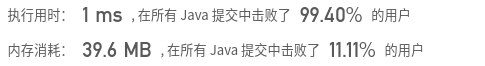
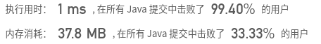
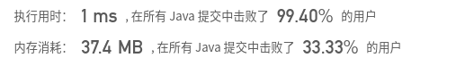

## [309. 最佳买卖股票时机含冷冻期](https://leetcode-cn.com/problems/best-time-to-buy-and-sell-stock-with-cooldown/)

## 题目

给定一个整数数组，其中第 i 个元素代表了第 i 天的股票价格 。

设计一个算法计算出最大利润。在满足以下约束条件下，你可以尽可能地完成更多的交易（多次买卖一支股票）:

+ 你不能同时参与多笔交易（你必须在再次购买前出售掉之前的股票）。
+ 卖出股票后，你无法在第二天买入股票 (即冷冻期为 1 天)。

```java
示例:

输入: [1,2,3,0,2]
输出: 3 
解释: 对应的交易状态为: [买入, 卖出, 冷冻期, 买入, 卖出]
```


链接：https://leetcode-cn.com/problems/best-time-to-buy-and-sell-stock-with-cooldown

## 解题记录

+ 通过动态规划记录状态
+ 每一个点有三种情况
  + 0:持有 可触发买入动作和继续持有
  + 1:卖出进入冰冻期 可触发卖出动作进入冰冻期
  + 2:不持有股票不在冰冻期 可通过1转移而来进入非冰冻期

+ 难点是通过`dp`记录整体资金情况，而不是单纯记录获利情况
+ 因为追求的是整体获利的提升，那么直接通过大小的比较就可以做到持有冰冻期等状态的切换，而不用做记录

```java
/**
 * @author ffzs
 * @describe
 * @date 2020/7/10
 */
public class Solution {
    public int maxProfit(int[] prices) {
        int len = prices.length;
        if (len == 0) return 0;
        int[][] dp = new int[len][3];
        dp[0][0] = -prices[0];
        // 0:持有 可触发买入动作和继续持有
        // 1:卖出进入冰冻期 可触发卖出动作进入冰冻期
        // 2:不持有股票不在冰冻期  可通过1转移而来进入非冰冻期
        for (int i = 1; i < len; i++) {
            dp[i][0] = Math.max(dp[i-1][0], dp[i-1][2] - prices[i]);
            dp[i][1] = dp[i-1][0] + prices[i];
            dp[i][2] = Math.max(dp[i-1][2], dp[i-1][1]); // 由于上一轮为卖出状态处于冰冻期一定是收益有所增加即dp[i-1][1]>dp[i-1][2], 因此通过取max间接判断了是否为冰冻期
        }
        return Math.max(dp[len-1][1], dp[len-1][2]);
    }
}
```



+ 应为只用到了`dp[i-1]`的数据，因此可以简化dp数组，减少空间占用


```java

/**
 * @author ffzs
 * @describe
 * @date 2020/7/10
 */
public class Solution2 {
    public static int maxProfit(int[] prices) {
        int len = prices.length;
        if (len == 0) return 0;
        int[] dp = new int[3];
        dp[0] = -prices[0];
        // 0:持有 可触发买入动作和继续持有
        // 1:卖出进入冰冻期 可触发卖出动作进入冰冻期
        // 2:不持有股票不在冰冻期  可通过1转移而来进入非冰冻期
        for (int i = 1; i < len; i++) {
            int t0 = dp[0], t1 = dp[1], t2 = dp[2];
            dp[0] = Math.max(t0, t2 - prices[i]);
            dp[1] = t0 + prices[i];
            dp[2] = Math.max(t2, t1); // 由于上一轮为卖出状态处于冰冻期一定是收益有所增加即dp[i-1][1]>dp[i-1][2], 因此通过取max间接判断了是否为冰冻期
        }
        return Math.max(dp[1], dp[2]);
    }

    public static void main(String[] args) {
        int[] prices = {1,2,3,0,2};
        System.out.println(maxProfit(prices));
    }
}

```



+ 变量再优化

```java
/**
 * @author ffzs
 * @describe
 * @date 2020/7/10
 */
public class Solution3 {
    public static int maxProfit(int[] prices) {
        int[] dp = new int[3];
        dp[0] = Integer.MIN_VALUE;
        for (int price : prices) {
            int t1 = dp[1];
            dp[1] = dp[0] + price;
            dp[0] = Math.max(dp[0], dp[2] - price);
            dp[2] = Math.max(dp[2], t1);
        }
        return Math.max(dp[1], dp[2]);
    }
    
    public static void main(String[] args) {
        int[] prices = {1,2,3,0,2};
        System.out.println(maxProfit(prices));
    }
}
```

