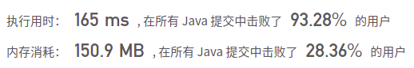

## 1707. 与数组中元素的最大异或值

## 题目

给你一个由非负整数组成的数组 nums 。另有一个查询数组 queries ，其中 queries[i] = [xi, mi] 。

第 i 个查询的答案是 xi 和任何 nums 数组中不超过 mi 的元素按位异或（XOR）得到的最大值。换句话说，答案是 max(nums[j] XOR xi) ，其中所有 j 均满足 nums[j] <= mi 。如果 nums 中的所有元素都大于 mi，最终答案就是 -1 。

返回一个整数数组 answer 作为查询的答案，其中 answer.length == queries.length 且 answer[i] 是第 i 个查询的答案。

```java
示例 1：
输入：nums = [0,1,2,3,4], queries = [[3,1],[1,3],[5,6]]
输出：[3,3,7]
解释：
1) 0 和 1 是仅有的两个不超过 1 的整数。0 XOR 3 = 3 而 1 XOR 3 = 2 。二者中的更大值是 3 。
2) 1 XOR 2 = 3.
3) 5 XOR 2 = 7.
    
示例 2：
输入：nums = [5,2,4,6,6,3], queries = [[12,4],[8,1],[6,3]]
输出：[15,-1,5]
```


```java
提示：

1 <= nums.length, queries.length <= 105
queries[i].length == 2
0 <= nums[j], xi, mi <= 109
```


链接：https://leetcode-cn.com/problems/maximum-xor-with-an-element-from-array

## 解题记录

+ 直接暴力解法，去中后循环遍历

```java
/**
 * @author: ffzs
 * @Date: 2021/5/23 上午7:13
 */
public class Solution {

    public int[] maximizeXor(int[] nums, int[][] queries) {
        int[] res = new int[queries.length];

        Arrays.sort(nums);
        int n = 1;
        for (int i = 1; i < nums.length; i++) {
            if (nums[i] != nums[i-1]) nums[n++] = nums[i];
        }
        

        int max = -1;
        for (int i = 0; i < queries.length; i++) {
            int idx = queries[i][1], aim = queries[i][0];
            for (int j = 0; j < n; j++) {
                if (nums[j] <= idx) max = Math.max(max, aim^nums[j]);
            }
            res[i] = max;
            max = -1;
        }
        return res;
    }
}

class Test {
    public static void main(String[] args) {
        int[] nums = {0,1,2,3,4};
        int[][] queries = {{3,1}, {1,3}, {5,6}};
        Solution s = new Solution();

        System.out.println(Arrays.toString(s.maximizeXor(nums, queries)));
    }
}
```

+ 超时没商量


## 进阶

+ 优先将每个nums中的数值转化为二进制形式，然后放入字典树中
+ 浅层逻辑就是数值的位数越高为1，那么它的值就越大
+ 在对比val的时候将小于m的值写入字典树中，然后查找，优先选择异或以后值为1的路线

```java
/**
 * @author: ffzs
 * @Date: 2021/5/23 上午7:35
 */
public class Solution2 {

    public int[] maximizeXor(int[] nums, int[][] queries) {
        int[] res = new int[queries.length];

        Arrays.sort(nums);
        int n = 1;
        for (int i = 1; i < nums.length; i++) {
            if (nums[i] != nums[i-1]) nums[n++] = nums[i];
        }

        int[][] queries_ = new int[queries.length][3];
        for (int i = 0; i < queries.length; i++) {
            res[i] = -1;
            queries_[i][0] = queries[i][0];
            queries_[i][1] = queries[i][1];
            queries_[i][2] = i;
        }

        Arrays.sort(queries_, Comparator.comparingInt(a -> a[1]));
        Trie tree = new Trie();
        int i = 0;
        for (int[] query : queries_) {
            int x = query[0], m = query[1], idx = query[2];
            while (i < n && nums[i] <= m) tree.insert(nums[i++]);

            if (i != 0) res[idx] = tree.findMax(x);
        }

        return res;
    }

    static class Trie {
        private static final int L = 30;
        Trie[] children = new Trie[2];


        private void insert (int v) {
            Trie tree = this;
            for (int l = L-1; l >= 0; l--) {
                int b = (v >> l) & 1;
                if (tree.children[b] == null) tree.children[b] = new Trie();
                tree = tree.children[b];
            }
        }

        private int findMax(int v) {
            int ret = 0;

            Trie tree = this;
            for (int l = L-1; l >= 0; l--) {
                int b = (v>>l) & 1;
                if (tree.children[b ^ 1] != null) {
                    ret |= 1<<l;
                    b ^= 1;
                }
                tree = tree.children[b];
            }
            return ret;
        }
    }

}
```




