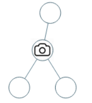
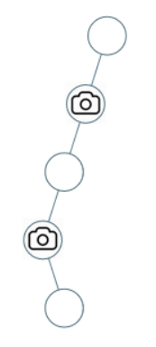
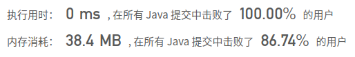

## [968. 监控二叉树](https://leetcode-cn.com/problems/binary-tree-cameras/)

## 题目

给定一个二叉树，我们在树的节点上安装摄像头。

节点上的每个摄影头都可以监视其父对象、自身及其直接子对象。

计算监控树的所有节点所需的最小摄像头数量。

 

```java
示例 1：


输入：[0,0,null,0,0]
输出：1
解释：如图所示，一台摄像头足以监控所有节点。
```



```java
示例 2：


输入：[0,0,null,0,null,0,null,null,0]
输出：2
解释：需要至少两个摄像头来监视树的所有节点。 上图显示了摄像头放置的有效位置之一。
```


```java
提示：

给定树的节点数的范围是 [1, 1000]。
每个节点的值都是 0。
```


链接：https://leetcode-cn.com/problems/binary-tree-cameras

## 解题记录

+ 为了优先判断子节点状态，通过后续遍历遍历树
+ 子叶子上有监控是不划算的，因此我们要判断叶子，并且在叶子的父节点上安装监控
+ 这里设定三个状态
  + 2: 该节点安装了监控
  + 1：改节点的某一个子节点安装了监控
  + 0：改节点的子节点没有安装监控

+ 根据三个状态也可以推导出状态转移：
  + 如果子节点有一个为0的话，就需要安装监控，该节点记作2,总数加一
  + 如果子节点中没有0,并且有2的话，那么说明改节点不需要安装监控，记作1
  + 其他情况自己点都是1,记作0,跳过让其父节点安装
  + 如果根节点为0的话，因为他没有父节点，所以需要安装摄像机，并总数加一

```java
/**
 * @author: ffzs
 * @Date: 2020/9/22 上午7:05
 */

class TreeNode {
    int val;
    TreeNode left;
    TreeNode right;
    TreeNode(int x) { val = x; }
}

public class Solution {

    int res = 0;
    public int minCameraCover(TreeNode root) {
        if (root == null) return 0;
        int val = dfs(root);
        return val == 0? res+1:res;
    }

    private int dfs (TreeNode root) {
        if (root.right == null && root.left == null) {
            return 0;
        }
        int right = -1, left = -1;
        if (root.left != null) {
            left = dfs(root.left);
        }
        if (root.right != null){
            right = dfs(root.right);
        }
        if (right==0 || left==0) {
            res++;
            return 2;
        }
        if (left == 2|| right == 2) {
            return 1;
        }
        return 0;
    }
}
```

