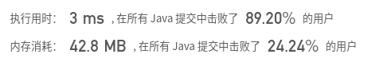
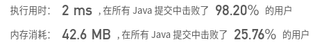

## [64. 最小路径和](https://leetcode-cn.com/problems/minimum-path-sum/)

## 题目

给定一个包含非负整数的 m x n 网格，请找出一条从左上角到右下角的路径，使得路径上的数字总和为最小。

说明：每次只能向下或者向右移动一步。

```java
示例:

输入:
[
  [1,3,1],
  [1,5,1],
  [4,2,1]
]
输出: 7
解释: 因为路径 1→3→1→1→1 的总和最小。

```


链接：https://leetcode-cn.com/problems/minimum-path-sum


## 解题记录

+ 比较基础的动态规划题目
+ 状态转移为通过本格子累加上面或是左边最小的那个
+ `dp[i][j] = Math.min(dp[i-1][j], dp[i][j-1]) + grid[i-1][j-1];`

```java
/**
 * @author: ffzs
 * @Date: 2020/7/23 上午7:50
 */
public class Solution {
    public static int minPathSum(int[][] grid) {
        int m = grid.length, n = grid[0].length;
        int[][] dp = new int[m+1][n+1];
        Arrays.fill(dp[0], Integer.MAX_VALUE);
        for (int i = 2; i < m + 1; i++) dp[i][0] = Integer.MAX_VALUE;
        for (int i = 1; i < m + 1; ++i) {
            for (int j = 1; j < n + 1; ++j) {
                dp[i][j] = Math.min(dp[i-1][j], dp[i][j-1]) + grid[i-1][j-1];
            }
        }
        return dp[m][n];
    }

    public static void main(String[] args) {
        int[][] grid = {{1,3,1}, {1,5,1}, {4,2,1}};
        System.out.println(minPathSum(grid));
    }
}

```



+ 优化空间，使用本表进行修改

```java
/**
 * @author: ffzs
 * @Date: 2020/7/23 上午8:04
 */
public class Solution3 {
    public static int minPathSum(int[][] grid) {
        int m = grid.length, n = grid[0].length;
        for (int i = 1; i < m; ++i) grid[i][0] += grid[i-1][0];
        for (int i = 1; i < n; ++i) grid[0][i] += grid[0][i-1];
        for (int i = 1; i < m; ++i) {
            for (int j = 1; j < n; ++j) {
                grid[i][j] += Math.min(grid[i-1][j], grid[i][j-1]);
            }
        }
        return grid[m-1][n-1];
    }

    public static void main(String[] args) {
        int[][] grid = {{1,3,1}, {1,5,1}, {4,2,1}};
        System.out.println(minPathSum(grid));
    }
}
```

