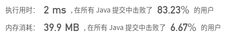

## [209. 长度最小的子数组](https://leetcode-cn.com/problems/minimum-size-subarray-sum/)

## 题目

给定一个含有 n 个正整数的数组和一个正整数 s ，找出该数组中满足其和 ≥ s 的长度最小的连续子数组，并返回其长度。如果不存在符合条件的连续子数组，返回 0。

```java
示例: 

输入: s = 7, nums = [2,3,1,2,4,3]
输出: 2
解释: 子数组 [4,3] 是该条件下的长度最小的连续子数组。
```

```java
进阶:

如果你已经完成了O(n) 时间复杂度的解法, 请尝试 O(n log n) 时间复杂度的解法。
```


链接：https://leetcode-cn.com/problems/minimum-size-subarray-sum

## 解题记录

+ 通过左右两个指针计算加和，left<=right，如果加和大于等于s的话那么更新距离，加和减去left并且left前进以为
+ 如果加和小于s的话right前进以为并加上此时right的值，知道right到最后

```java
/**
 * @author ffzs
 * @describe
 * @date 2020/6/28
 */
public class Solution {
    public static int minSubArrayLen(int s, int[] nums) {
        int len = nums.length;
        int left = 0, right = 0;
        if (len == 0) return 0;
        int sum = nums[left];
        int res = len + 1;
        while (true) {
            if (sum >= s) {
                if (left == right) return 1;
                res = Math.min(res, right-left+1);
                sum -= nums[left ++];
            }
            else{
                right ++;
                if (right == len) break;
                sum += nums[right];
            }
        }
        return res==len+1 ? 0:res;
    }

    public static void main(String[] args) {
        int[] nums = {2,3,1,2,4,3};
        System.out.println(minSubArrayLen(7, nums));
    }
}

```



## 