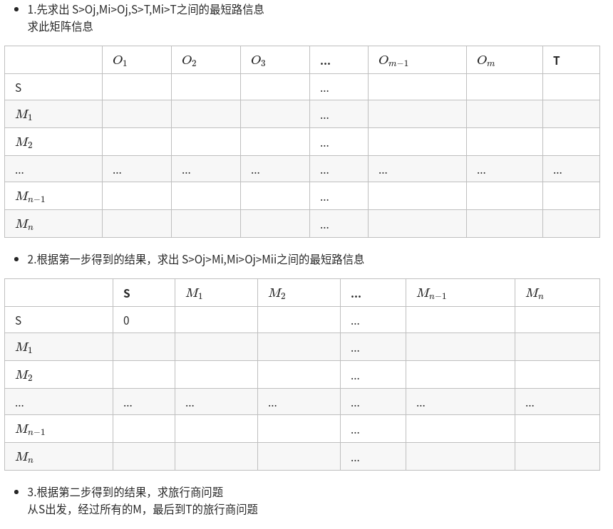
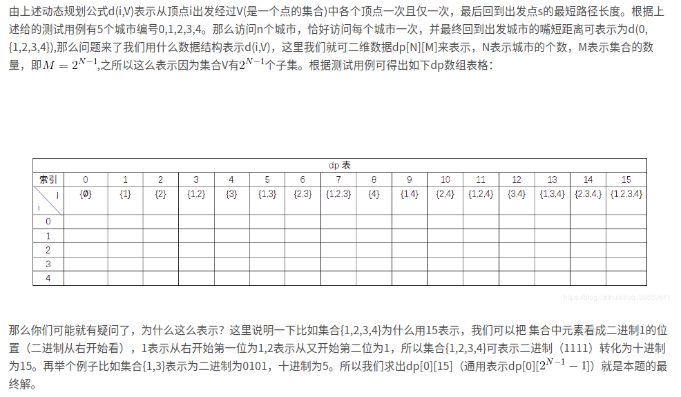
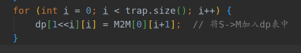

## [LCP 13. 寻宝](https://leetcode-cn.com/problems/xun-bao/)

## 题目

我们得到了一副藏宝图，藏宝图显示，在一个迷宫中存在着未被世人发现的宝藏。

迷宫是一个二维矩阵，用一个字符串数组表示。它标识了唯一的入口（用 'S' 表示），和唯一的宝藏地点（用 'T' 表示）。但是，宝藏被一些隐蔽的机关保护了起来。在地图上有若干个机关点（用 'M' 表示），只有所有机关均被触发，才可以拿到宝藏。

要保持机关的触发，需要把一个重石放在上面。迷宫中有若干个石堆（用 'O' 表示），每个石堆都有无限个足够触发机关的重石。但是由于石头太重，我们一次只能搬一个石头到指定地点。

迷宫中同样有一些墙壁（用 '#' 表示），我们不能走入墙壁。剩余的都是可随意通行的点（用 '.' 表示）。石堆、机关、起点和终点（无论是否能拿到宝藏）也是可以通行的。

我们每步可以选择向上/向下/向左/向右移动一格，并且不能移出迷宫。搬起石头和放下石头不算步数。那么，从起点开始，我们最少需要多少步才能最后拿到宝藏呢？如果无法拿到宝藏，返回 -1 。


```java
示例 1：

输入： ["S#O", "M..", "M.T"]
输出：16
解释：最优路线为： S->O, cost = 4, 去搬石头 O->第二行的M, cost = 3, M机关触发 第二行的M->O, cost = 3, 我们需要继续回去 O 搬石头。 O->第三行的M, cost = 4, 此时所有机关均触发 第三行的M->T, cost = 2，去T点拿宝藏。 总步数为16。 
```


```java
示例 2：

输入： ["S#O", "M.#", "M.T"]
输出：-1
解释：我们无法搬到石头触发机关
```

```java
示例 3：

输入： ["S#O", "M.T", "M.."]
输出：17
解释：注意终点也是可以通行的
```

```java
限制：
    
1 <= maze.length <= 100
1 <= maze[i].length <= 100
maze[i].length == maze[j].length
S 和 T 有且只有一个
0 <= M的数量 <= 16
0 <= O的数量 <= 40，题目保证当迷宫中存在 M 时，一定存在至少一个 O 。
```

链接：https://leetcode-cn.com/problems/xun-bao

## 解题记录

+ 定位石头和陷阱位置，如果有陷阱，但是没有石头或者无法访问石头，直接返回-1
+ 模拟运行情况的话，是通过S->O->M->O->M->T的顺序进行
+ 我们先分步解决，将S到O的距离，O到M的距离，M到T的距离都求得，之后就是旅行问题



+ 旅行商问题通过动态规划处理



+ 设置dp起始状态，就是通过S起始



```java
/**
 * @author: ffzs
 * @Date: 2020/7/29 上午7:59
 */

public class Solution {
    char[][] step;
    int[][] directions = {{-1, 0}, {1, 0}, {0, 1}, {0, -1}};
    int n, m;

    public int minimalSteps(String[] maze) {
        n = maze.length;
        m = maze[0].length();
        step = new char[n][m];

        for (int i = 0; i < n; ++i) {
            step[i] = maze[i].toCharArray();
        }

        List<int[]> stone = new ArrayList<>();
        List<int[]> trap = new ArrayList<>();
        int[] start = new int[2];
        int[] end = new int[2];

        for (int i = 0; i < n; ++i) {
            for (int j = 0; j < m; ++j) {
                if (!checkAvailable(i, j)){
                    if (step[i][j] == 'M' || step[i][j] == 'S' || step[i][j] == 'T')
                        return -1;  // 如果不能到达起点，终点，或者陷阱的话直接返回-1
                    else continue;
                }
                switch (step[i][j]) {
                    case 'S': {start = new int[]{i, j}; break;}
                    case 'T': {end = new int[]{i, j}; break;}
                    case 'O': {stone.add(new int[] {i, j}); break;}
                    case 'M': {trap.add(new int[] {i, j}); break;}
                }
            }
        }

        if (trap.size() > 0 && stone.size() == 0) return -1;  // 如果有陷阱，但是石头无法到达直接返回-1

        int[][] startTable = getDistance(start);
        if (trap.size() == 0) return startTable[end[0]][end[1]];  // 如果没有陷阱的话，那么直接通过起点到达终点

        List<int[]> stoneNew = new ArrayList<>(stone);
        stoneNew.add(end);
        List<int[]> trapNew = new ArrayList<>(trap);
        trapNew.add(0,start);

        int[][] distanceTable = new int[trapNew.size()][stoneNew.size()];

        for (int i = 0; i < trapNew.size(); i++) {
            int[][] disTable = getDistance(trapNew.get(i));
            for (int j = 0; j < stoneNew.size(); j++) {
                int[] stn = stoneNew.get(j);
                distanceTable[i][j] = disTable[stn[0]][stn[1]];
            }
        }

//        System.out.println(Arrays.deepToString(distanceTable));
        int[][] M2M = new int[trapNew.size()][trapNew.size()];

        for (int i = 0; i < M2M.length; ++i) {
            int[] m12o = distanceTable[i];
            for (int j = i; j < M2M.length; ++j) {
                if (i == j) continue;
                int[] m22o =  distanceTable[j];
                int min = Integer.MAX_VALUE;
                for (int k = 0; k < m12o.length-1; ++k) {
                    if (m12o[k]+m22o[k] > 0 && m12o[k]+m22o[k]<min)
                    min = m12o[k]+m22o[k];
                }
                if (min == Integer.MAX_VALUE) return -1;
                M2M[i][j] = min;
                M2M[j][i] = min;
            }
        }

//        System.out.println(Arrays.deepToString(M2M));

        for (int i = 0; i < M2M.length; i++) {
            if (distanceTable[i][stoneNew.size()-1] == -1) return -1;
        }

        int[][] dp = new int[1<<trap.size()][trap.size()];
        for (int[] ints : dp) {
            Arrays.fill(ints, -1);
        }
        for (int i = 0; i < trap.size(); i++) {
            dp[1<<i][i] = M2M[0][i+1];  // 将S->M加入dp表中
        }

        for (int mask = 1; mask < (1<<trap.size()); mask++) {
            for (int i = 0; i < trap.size(); i++) {
                if ((mask & (1<<i)) != 0) {
                    for (int j = 0; j < trap.size(); j++) {
                        if ((mask & (1<<j)) == 0) {
                            int next = mask | (1<<j);
                            if (dp[next][j] == -1 || dp[next][j] > dp[mask][i] + M2M[i+1][j+1])
                                dp[next][j] = dp[mask][i] + M2M[i+1][j+1];
                        }
                    }
                }
            }
        }

        int res = -1;
        int last = (1<<trap.size()) - 1;
        for (int i = 0; i < trap.size(); i++) {
            if (res == -1 || res > dp[last][i] + distanceTable[i+1][stoneNew.size()-1]) {
                res = dp[last][i] + distanceTable[i+1][stoneNew.size()-1];
            }
        }
        return res;
    }

    private int[][] getDistance (int[] s) {
        int[][] dp = new int[n][m];
        for (int[] ints : dp) Arrays.fill(ints, -1);
        dp[s[0]][s[1]] = 0;
        Queue<int[]> queue = new LinkedList<>();
        queue.add(new int[]{s[0], s[1]});
        while (!queue.isEmpty()) {
            int[] item = queue.poll();
            int i = item[0], j = item[1];
            for (int[] direction : directions) {
                int ii = i + direction[0], jj = j + direction[1];
                if (ii >= 0 && ii < n && jj >= 0 && jj < m && step[ii][jj] != '#' && dp[ii][jj] == -1) {
                    dp[ii][jj] = dp[i][j] + 1;
                    queue.add(new int[]{ii, jj});
                }
            }
        }
        return dp;
    }

    private boolean checkAvailable (int i, int j) {
        for (int[] direction : directions) {
            int ii = direction[0] + i;
            int jj = direction[1] + j;
            if (ii >= 0 && ii < n && jj >= 0 && jj < m && step[ii][jj] != '#') return true;
        }
        return false;
    }
}


class Test {
    public static void main(String[] args) {
        Solution solution = new Solution();
        String[] maze = {"TMM", "..M", "OOS", "#O.", ".#O", "O##"};
//        String[] maze = {"S#O", "M.T", "M.."};
        System.out.println(solution.minimalSteps(maze));
    }
}
```

