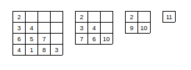

## [120. 三角形最小路径和](https://leetcode-cn.com/problems/triangle/)

## 题目

给定一个三角形，找出自顶向下的最小路径和。每一步只能移动到下一行中相邻的结点上。

相邻的结点 在这里指的是 下标 与 上一层结点下标 相同或者等于 上一层结点下标 + 1 的两个结点。

 

```java
例如，给定三角形：

[
     [2],
    [3,4],
   [6,5,7],
  [4,1,8,3]
]
自顶向下的最小路径和为 11（即，2 + 3 + 5 + 1 = 11）。
```

 

```java
说明：

如果你可以只使用 O(n) 的额外空间（n 为三角形的总行数）来解决这个问题，那么你的算法会很加分。
```


链接：https://leetcode-cn.com/problems/triangle


## 解题记录

+ 从下向上叠加
+ 返回最上层



```java
/**
 * @author ffzs
 * @describe
 * @date 2020/7/14
 */
public class Solution {
    public static int minimumTotal(List<List<Integer>> triangle) {
        int[] tmp = new int[triangle.size()];
        int n = triangle.size();
        List<Integer> last = triangle.get(n - 1);
        for (int i = 0; i < last.size(); ++i) {
            tmp[i] = last.get(i);
        }

        for (int i = n-2; i >= 0; --i) {
            List<Integer> level = triangle.get(i);
            for (int i1 = 0; i1 < level.size(); ++i1) {
                tmp[i1] = Math.min(tmp[i1], tmp[i1+1]) + level.get(i1);
            }
        }
        return tmp[0];
    }

    public static void main(String[] args) {
        List<List<Integer>> triangle = new ArrayList<>();
        triangle.add(new ArrayList<>(List.of(2)));
        triangle.add(new ArrayList<>(List.of(3,4)));
        triangle.add(new ArrayList<>(List.of(6,5,7)));
        triangle.add(new ArrayList<>(List.of(4,1,8,3)));
        System.out.println(minimumTotal(triangle));
    }
}

```


