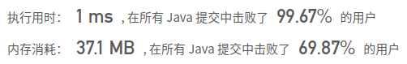

## [771. 宝石与石头](https://leetcode-cn.com/problems/jewels-and-stones/)

## 题目

给定字符串J 代表石头中宝石的类型，和字符串 S代表你拥有的石头。 S 中每个字符代表了一种你拥有的石头的类型，你想知道你拥有的石头中有多少是宝石。

J 中的字母不重复，J 和 S中的所有字符都是字母。字母区分大小写，因此"a"和"A"是不同类型的石头。

```java
示例 1:

输入: J = "aA", S = "aAAbbbb"
输出: 3
```

```java
示例 2:

输入: J = "z", S = "ZZ"
输出: 0
```

```java
注意:

S 和 J 最多含有50个字母。
 J 中的字符不重复。
```


链接：https://leetcode-cn.com/problems/jewels-and-stones

## 解题记录

+ 因为只是珠宝的字符只能是大小写字母，那么通过一个数组记录有哪些珠宝
+ 然后S中有多少J中包含

```java
/**
 * @author: ffzs
 * @Date: 2020/10/2 上午7:46
 */


public class Solution {

    public int numJewelsInStones(String J, String S) {
        boolean[] js = new boolean[('z' - 'A') + 1];
        int counter = 0;
        for (int i = 0; i < J.length(); i++) {
            js[J.charAt(i)-'A'] = true;
        }

        for (int i = 0; i < S.length(); i++) {
            if (js[S.charAt(i)-'A']) counter++;
        }
        return counter;
    }

}
```

