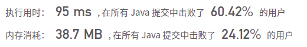

## [839. 相似字符串组](https://leetcode-cn.com/problems/similar-string-groups/)

## 题目

如果交换字符串 X 中的两个不同位置的字母，使得它和字符串 Y 相等，那么称 X 和 Y 两个字符串相似。如果这两个字符串本身是相等的，那它们也是相似的。

例如，"tars" 和 "rats" 是相似的 (交换 0 与 2 的位置)； "rats" 和 "arts" 也是相似的，但是 "star" 不与 "tars"，"rats"，或 "arts" 相似。

总之，它们通过相似性形成了两个关联组：{"tars", "rats", "arts"} 和 {"star"}。注意，"tars" 和 "arts" 是在同一组中，即使它们并不相似。形式上，对每个组而言，要确定一个单词在组中，只需要这个词和该组中至少一个单词相似。

给你一个字符串列表 strs。列表中的每个字符串都是 strs 中其它所有字符串的一个字母异位词。请问 strs 中有多少个相似字符串组？

 

```java
示例 1：

输入：strs = ["tars","rats","arts","star"]
输出：2
示例 2：

输入：strs = ["omv","ovm"]
输出：1
```


```java
提示：

1 <= strs.length <= 100
1 <= strs[i].length <= 1000
sum(strs[i].length) <= 2 * 104
strs[i] 只包含小写字母。
strs 中的所有单词都具有相同的长度，且是彼此的字母异位词。
```


备注：

      字母异位词（anagram），一种把某个字符串的字母的位置（顺序）加以改换所形成的新词。


链接：https://leetcode-cn.com/problems/similar-string-groups


## 解题记录

+ 嵌套循环，两两比较，如果为相似通过并查集关联，最终检查有几个父节点

```java
/**
 * @author: ffzs
 * @Date: 2021/1/31 上午8:37
 */


class UnionFind {
    int[] f;

    public UnionFind(int n) {
        f = new int[n];
        for (int i = 0; i < n; i++) {
            f[i] = i;
        }
    }

    public int find(int i) {
        if (f[i] != i) f[i] = find(f[i]);
        return f[i];
    }

    public void union(int i, int j) {
        f[find(i)] = find(j);
    }

    public boolean connected(int i, int j) {
        return find(i) == find(j);
    }
}
public class Solution {

    public int numSimilarGroups(String[] strs) {
        int n = strs.length;

        UnionFind uni = new UnionFind(n);
        for (int i = 0; i < n; i++) {
            for (int j = i + 1; j < n; j++) {
                if (uni.connected(i, j)) continue;
                if (isSame(strs[i], strs[j])) uni.union(i, j);
            }
        }

        int res = 0;
        for (int i = 0; i < n; i++) {
            if (uni.find(i) == i) res++;
        }
        return res;
    }

    private boolean isSame(String s1, String s2) {
        int count = 0;
        char[] c1 = s1.toCharArray();
        char[] c2 = s2.toCharArray();

        for (int i = 0; i < c1.length; i++) {
            if (c1[i] != c2[i]) count++;
            if (count > 2) return false;
        }
        return true;
    }

}
```

