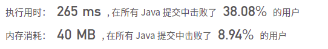

## 1074. 元素和为目标值的子矩阵数量

## 题目

给出矩阵 matrix 和目标值 target，返回元素总和等于目标值的非空子矩阵的数量。

子矩阵 x1, y1, x2, y2 是满足 x1 <= x <= x2 且 y1 <= y <= y2 的所有单元 matrix[x][y] 的集合。

如果 (x1, y1, x2, y2) 和 (x1', y1', x2', y2') 两个子矩阵中部分坐标不同（如：x1 != x1'），那么这两个子矩阵也不同。

 

```java
示例 1：
输入：matrix = [[0,1,0],[1,1,1],[0,1,0]], target = 0
输出：4
解释：四个只含 0 的 1x1 子矩阵。
    
示例 2：
输入：matrix = [[1,-1],[-1,1]], target = 0
输出：5
解释：两个 1x2 子矩阵，加上两个 2x1 子矩阵，再加上一个 2x2 子矩阵。
    
示例 3：
输入：matrix = [[904]], target = 0
输出：0
```

```java
提示：

1 <= matrix.length <= 100
1 <= matrix[0].length <= 100
-1000 <= matrix[i] <= 1000
-10^8 <= target <= 10^8
```


链接：https://leetcode-cn.com/problems/number-of-submatrices-that-sum-to-target

## 解题记录

+ 优先求出累加矩阵:  `tmp[i][j] = tmp[i-1][j] + tmp[i][j-1] + matrix[i-1][j-1] - tmp[i-1][j-1];`
+ 然后通过遍历矩阵，然后求出每一个子矩阵的和，如果和target相同那么记录1


```java
/**
 * @author: ffzs
 * @Date: 2021/5/29 上午8:46
 */
public class Solution {

    public int numSubmatrixSumTarget(int[][] matrix, int target) {
        int m = matrix.length, n = matrix[0].length;

        int[][] tmp = new int[m+1][n+1];

        for (int i = 1; i <= m; i++) {
            for (int j = 1; j <= n; j++) {
                tmp[i][j] = tmp[i-1][j] + tmp[i][j-1] + matrix[i-1][j-1] - tmp[i-1][j-1];
            }
        }

        int res = 0;
        for (int i = 1; i <= m; i++) {
            for (int j = 1; j <= n; j++) {
                for (int ii = 0; ii < i; ii++) {
                    for (int jj = 0; jj < j; jj++) {
                        if ((tmp[i][j] + tmp[ii][jj] - tmp[i][jj] - tmp[ii][j]) == target) res++;
                    }
                }
            }
        }

        return res;
    }

}
```

