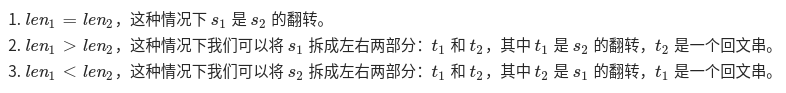

336. 回文对](https://leetcode-cn.com/problems/palindrome-pairs/)

## 题目

给定一组唯一的单词， 找出所有不同 的索引对(i, j)，使得列表中的两个单词， words[i] + words[j] ，可拼接成回文串。

```java
示例 1:

输入: ["abcd","dcba","lls","s","sssll"]
输出: [[0,1],[1,0],[3,2],[2,4]] 
解释: 可拼接成的回文串为 ["dcbaabcd","abcddcba","slls","llssssll"]
```


```java
示例 2:

输入: ["bat","tab","cat"]
输出: [[0,1],[1,0]] 
解释: 可拼接成的回文串为 ["battab","tabbat"]
```


链接：https://leetcode-cn.com/problems/palindrome-pairs


## 解题记录

+ 暴力解法
+ 直接编写判断字符串回文方法
+ 通过双循环组合所有情况判断

```java
/**
 * @author: ffzs
 * @Date: 2020/8/6 上午7:29
 */
public class Solution {
    public List<List<Integer>> palindromePairs(String[] words) {
        int n = words.length;
        List<List<Integer>> res = new ArrayList<>();
        for (int i = 0; i < n; ++i) {
            for (int j = i+1; j < n; j++) {
                if (palindrome(words[i], words[j])) res.add(Arrays.asList(i,j));
                if (palindrome(words[j], words[i])) res.add(Arrays.asList(j,i));
            }
        }
        return res;
    }

    private boolean palindrome (String s1, String s2) {
        String s = s1 + s2;
        int l = 0, r = s.length() -1;
        while (l < r) {
            if (s.charAt(l) != s.charAt(r)) return false;
            l ++;
            r --;
        }
        return true;
    }
}


```

不出所料的超时，毕竟是困难难度：


## 进阶

+ 通过使用前缀树进行统计， 前缀树可以看这个  [Leetcode:面试题 17.13. 恢复空格 动态规划+Trie树](https://blog.csdn.net/tonydz0523/article/details/107235745)
+ 对于两个字符串组成的回文字符串有三种情况
+ 
+ 选定一个字符串以后，通过指针将字符串分割，分别判断逆序是否匹配，剩下部分是否回文，来判断能否组合成回文字符
+ 对逆序的匹配选用前缀树，也可以使用哈希表

```java
/**
 * @author: ffzs
 * @Date: 2020/8/6 上午8:05
 */

class TrieNode {
    int isEnd = -1;
    TrieNode[] children = new TrieNode[26];

    public TrieNode() {}
}

class Trie {
    public Trie(){}

    public TrieNode root = new TrieNode();

    public void insert (String word, int index) {
        TrieNode cur = root;
        for (int i = word.length()-1; i >= 0; --i) {
            int c = word.charAt(i) - 'a';
            if (cur.children[c] == null)
                cur.children[c] = new TrieNode();
            cur = cur.children[c];
        }
        cur.isEnd = index;
    }

    public int find(String s, int l, int r) {
        TrieNode cur = root;
        for (int i = l; i < r+1; ++i) {
            int c = s.charAt(i) - 'a';
            if (cur.children[c] == null) return -1;
            cur = cur.children[c];
        }
        return cur.isEnd;
    }
}

public class Solution2 {

    public List<List<Integer>> palindromePairs(String[] words) {
        int n = words.length;
        List<List<Integer>> res = new ArrayList<>();
        // 构建前缀树并将单词逆向写入
        Trie trie = new Trie();
        for (int i = 0; i < words.length; i++) {
            trie.insert(words[i], i);
        }
        for (int i = 0; i < n; ++i) {
            int m =words[i].length();
            for (int j = 0; j < m+1; ++j) {
                if (palindrome(words[i], j, m-1)) {
                    int id = trie.find(words[i], 0, j-1);
                    if (id != -1 && id != i) res.add(Arrays.asList(i, id));
                }

                if (j > 0 && palindrome(words[i], 0, j-1)) {
                    int id = trie.find(words[i], j ,m-1);
                    if (id != -1 && id != i) res.add(Arrays.asList(id, i));
                }
            }
        }
        return res;
    }

    private boolean palindrome (String s, int l, int r) {
        while (l < r) {
            if (s.charAt(l) != s.charAt(r)) return false;
            l ++;
            r --;
        }
        return true;
    }
}

class Test {
    public static void main(String[] args) {
        String[] words = {"abcd","dcba","lls","s","sssll"};
        Solution2 s = new Solution2();
        System.out.println(s.palindromePairs(words));
    }
}

```

