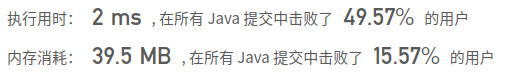
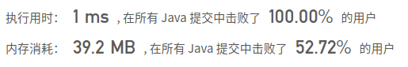

## [113. 路径总和 II](https://leetcode-cn.com/problems/path-sum-ii/)

## 题目

给定一个二叉树和一个目标和，找到所有从根节点到叶子节点路径总和等于给定目标和的路径。

说明: 叶子节点是指没有子节点的节点。

示例:
给定如下二叉树，以及目标和 sum = 22，

```java
          5
         / \
        4   8
       /   / \
      11  13  4
     /  \    / \
    7    2  5   1
```
```java
返回:

[
   [5,4,11,2],
   [5,8,4,5]
]
```


链接：https://leetcode-cn.com/problems/path-sum-ii

## 解题记录

+ 回溯算法，前序遍历
+ 遍历过程中对左右树进行加和回溯处理，如果加和为需要值，将list添加到结果列表中

```java
/**
 * @author: ffzs
 * @Date: 2020/9/26 上午7:05
 */

class TreeNode {
    int val;
    TreeNode left;
    TreeNode right;
    TreeNode(int x) { val = x; }
}


public class Solution {
    List<List<Integer>> res = new ArrayList<>();
    int sum;
    public List<List<Integer>> pathSum(TreeNode root, int sum) {
        this.sum = sum;
        if (root == null) return res;
        dfs(root, new ArrayList<>(List.of(root.val)), root.val);
        return  res;
    }

    private void dfs (TreeNode root, List<Integer> list, int vals) {
        if (root.left == null && root.right == null && vals == sum ) {
            res.add(new ArrayList<>(list));
            return;
        }
        if (root.left != null) {
            list.add(root.left.val);
            vals += root.left.val;
            System.out.println(vals);
            dfs(root.left, list, vals);
            list.remove(list.size()-1);
            vals -= root.left.val;
        }
        if (root.right != null) {
            list.add(root.right.val);
            vals += root.right.val;
            dfs(root.right, list, vals);
            list.remove(list.size()-1);
        }
    }
}
```



## 简化

```java
/**
 * @author: ffzs
 * @Date: 2020/9/26 上午7:36
 */
public class Solution2 {
    List<List<Integer>> res = new ArrayList<>();
    public List<List<Integer>> pathSum(TreeNode root, int sum) {
        dfs(root, new ArrayList<>(), sum);
        return res;
    }

    private void dfs (TreeNode root, List<Integer> list, int sum) {
        if (root == null) return;

        sum -= root.val;
        list.add(root.val);
        if (sum == 0 && root.right == null && root.left == null) {
            res.add(new ArrayList<>(list));
        }

        dfs(root.left, list, sum);
        dfs(root.right, list, sum);

        list.remove(list.size()-1);
    }
}
```

