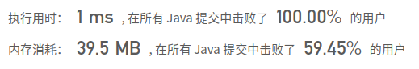

## [47. 全排列 II](https://leetcode-cn.com/problems/permutations-ii/)

## 题目

给定一个可包含重复数字的序列，返回所有不重复的全排列。

```
示例:

输入: [1,1,2]
输出:
[
  [1,1,2],
  [1,2,1],
  [2,1,1]
]
```


链接：https://leetcode-cn.com/problems/permutations-ii

## 解题记录

+ 回溯算法
+ 循环过程中要注意避免重复情况，可以减少计算步骤
+ 首先要将数组排序，将重复的情况放到一起
+ 每一层填数的时候检查是否和之前相同进行跳过，避免重复

```java
/**
 * @author: ffzs
 * @Date: 2020/9/18 上午6:54
 */


public class Solution {
    List<List<Integer>> res = new ArrayList<>();
    int[] nums;
    boolean[] step;
    public List<List<Integer>> permuteUnique(int[] nums) {
        this.nums = nums;
        Arrays.sort(nums);
        step = new boolean[nums.length];
        dfs(new ArrayList<>());
        return res;
    }

    private void dfs (List<Integer> list) {

        if (list.size() == nums.length) {
            res.add(new ArrayList<>(list));
            return;
        }

        for (int i = 0; i < nums.length; i++) {
            if(!step[i] && (i==0 || step[i-1] || nums[i-1] != nums[i])) {
                list.add(nums[i]);
                step[i] = true;
                dfs(list);
                list.remove(list.size()-1);
                step[i] = false;
            }
        }
    }
}

class Test {
    public static void main(String[] args) {
        Solution solution = new Solution();
        int[] nums = {1,1,2};
        System.out.println(solution.permuteUnique(nums));
    }
}
```

