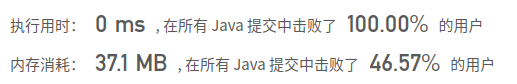
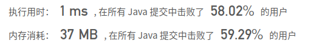

## [145. 二叉树的后序遍历](https://leetcode-cn.com/problems/binary-tree-postorder-traversal/)

## 题目

给定一个二叉树，返回它的 后序 遍历。

```java
示例:

输入: [1,null,2,3]  
   1
    \
     2
    /
   3 

输出: [3,2,1]
进阶: 递归算法很简单，你可以通过迭代算法完成吗？
```


链接：https://leetcode-cn.com/problems/binary-tree-postorder-traversal

## 解题记录

+ 递归法

```java
/**
 * @author: ffzs
 * @Date: 2020/9/29 上午7:43
 */

class TreeNode {
    int val;
    TreeNode left;
    TreeNode right;
    TreeNode() {}
    TreeNode(int val) { this.val = val; }
    TreeNode(int val, TreeNode left, TreeNode right) {
        this.val = val;
        this.left = left;
        this.right = right;
    }
}

public class Solution {
    List<Integer> res = new ArrayList<>();
    public List<Integer> postorderTraversal(TreeNode root) {
        dfs(root);
        return res;
    }

    private void dfs (TreeNode root) {
        if (root != null) {
            dfs(root.left);
            dfs(root.right);
            res.add(root.val);
        }
    }
}
```



## 进阶

+ 迭代法
+ 将栈写在代码了
+ 前序遍历是中左右，后续遍历是左右中，如果在前序遍历改一下先右后左的话，就是中右左，正好是后序遍历的逆向


```java
/**
 * @author: ffzs
 * @Date: 2020/9/29 上午7:47
 */
public class Solution2 {

    public List<Integer> postorderTraversal(TreeNode root) {
        List<Integer> res = new ArrayList<>();
        if (root == null) return res;

        Deque<TreeNode> stack = new LinkedList<>();

        stack.push(root);

        while (!stack.isEmpty()){
            TreeNode cur = stack.pop();
            res.add(0,cur.val);
            if (cur.left != null) stack.push(cur.left);
            if (cur.right != null) stack.push(cur.right);
        }
        return res;
    }
}
```

